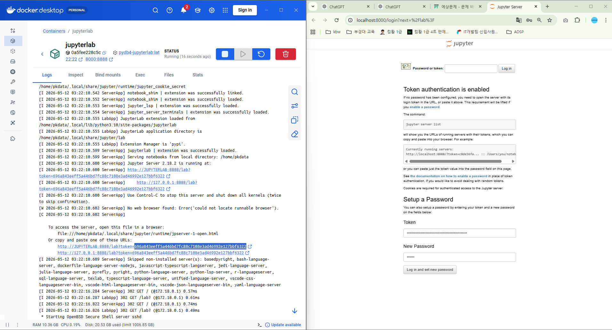

# 15주차

## 2026-05-11(64일차)
- 지피티한테 에이전트 지침서를 작성
- 도커
    ```powershell
    docker build -t ubunpy:1.0 .
    docker images
    docker run 

    docker build --no-cache -t ubunpy:1.2 .
    docker run -it ubunpy:1.2

    docker build -t py_lite:1.0 .
    docker run -it --rm py_lite:1.0
    ```

- 리액트
    ```powershell
    npm create vite@latest
    npm run dev
    ```

## 2026-05-12(65일차)
- 도커에서 주피터 랩을 실행해서 서버로 띄우기
- 도커에서 토큰 값, 비번 입력
- 외부 인터넷에서도 접속됨


```powershell
docker compose up -d

docker compose down 
docker compose up -d
```




- React
```powershell
npm install react-router-dom
```

dockerfile
```dockerfile
# 원하는 이미지 다운로드
FROM ubuntu:22.04
LABEL maintainer="YS plctohmi@gmail.com"
RUN apt update &&\
    apt upgrade -y &&\
    apt install -y sudo passwd openssh-server wget nano net-tools iputils-ping openjdk-8-jdk python3-pip &&\
    apt clean &&\
    rm -rf /var/lib/apt/lists/* &&\
    groupadd pkdata &&\
    useradd -m -d /home/pkdata -s /bin/bash -g pkdata -G sudo pkdata &&\
    echo "pkdata:1234" | chpasswd &&\   
    mkdir -p /home/pkdata/.ssh &&\
    chown -R pkdata:pkdata /home/pkdata
RUN echo "export JAVA_HOME=/usr/lib/jvm/java-8-openjdk-amd64" >> /home/pkdata/.bashrc &&\
    chown pkdata:pkdata /home/pkdata/.bashrc &&\
    mkdir -p /var/run/sshd &&\
    echo "PermitRootLogin no" >> /etc/ssh/sshd_config &&\
    echo "PasswordAuthentication yes" >> /etc/ssh/sshd_config   

USER pkdata

WORKDIR /home/pkdata

RUN pip install --upgrade pip && pip install jupyterlab

ENV PATH="/home/pkdata/.local/bin:$PATH"

CMD ["/bin/bash","-c","service ssh start && exec /bin/bash"]
```

docker-compose
```dockerfile
services:
  jupyterlab:
    build:
      context: .
      dockerfile: Dockerfile
    container_name: jupyterlab
    hostname: JUPYTERLAB
    ports:
      - "22:22"
      - "8000:8888"
    volumes:
      - D:\\data\\jupyter_data:/home/pkdata/data
    restart: always
    networks:
      - pknu_net
    command: bash -c "service ssh start && python3 -m jupyterlab --ip=0.0.0.0 --allow-root --FileContentManager.delete_to_trash=False"

  mysql:
    image: mysql:8.0
    container_name: mysql
    ports:
      - "3306:3306"
    volumes:
      - mysql_data:/var/lib/mysql
      - mysql_conf:/etc/mysql/mysql.conf.d
    environment:
      MYSQL_ROOT_PASSWORD: "1234"
    restart: always
    networks:
      - pknu_net
  mongodb:
    image: mongodb/mongodb-community-server:8.0.3-ubi8
    container_name: mongodb
    ports:
      - "27017:27017"
    volumes:
      - mongodb_data:/data/db # 공식이미지에 있는 기본 DB경로
    restart: always
    networks:
      - pknu_net
  oracle-db:
    image: gvenzl/oracle-xe:21-slim
    container_name: oracle-db
    ports:
      - "1521:1521"
      - "5500:5500"
    volumes:
      - oracle_data:/opt/oracle/oradata
    environment:
      ORACLE_PASSWORD: oracle
      APP_USER: pknu
      APP_USER_PASSWORD: 1234
    restart: unless-stopped
    networks:
      - pknu_net

  postgresql:
    image: bitnami/postgresql:latest
    container_name: postgresql
    ports:
      - "5432:5432"
    volumes:
      - postgre_data:/bitnami/postgresql
    environment:
      POSTGRESQL_USERNAME: pknu
      POSTGRESQL_PASSWORD: "1234"
      POSTGRESQL_DATABASE: appdb
    restart: unless-stopped
    networks:
      - pknu_net

  py3_sh:
    image: python:3.12-alpine
    container_name: py3
    working_dir: /app
    command: sh -c "tail -f /dev/null" # 컨테이너 유지
    ports:
      - "3300:3300"
    volumes:
      - py3_data:/app
    restart: unless-stopped
    networks:
      - pknu_net

volumes:
  mysql_data:
  mysql_conf:
  mongodb_data:
  oracle_data:
  postgre_data:
  py3_data:

networks:
  pknu_net:
    driver: bridge
```

## 2026-05-13(66일차)
- 도커
- 리액트

## 2026-05-14(67일차)
- 올라마
- 리액트

## 2026-05-15(68일차)
- 리액트