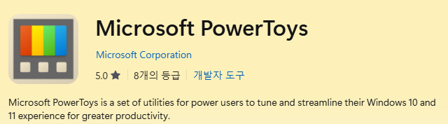

# 7주차
## 2026-03-16(27일차)
### 구글 스프레드시트를 활용한 온라인 설문지 조사
- 구글 폼 설문지에서 -> 개발자 도구 -> form에서 entry에서 값을 뽑음 -> html 파일에서 input의 name과 연동 -> 구글 스프레드 시트에서 연동되어 보임

즉, html 파일과 form을 연동시켜 웹사이트에서 정보를 입력하면 -> 구글 스프레드 시트에서 보임
### css


## 2026-03-17(28일차)
### css
### 도커 tomcat으로 서버를 돌려 html 테스트
- 도커를 명령어를 실행해서 하는것: tomcat 설치
```bash
docker build -t my-test .
```

```docker
FROM tomcat:9.0-jdk11-openjdk
WORKDIR /usr/local/tomcat
EXPOSE 8080
COPY test.jsp webapps/ROOT/hello.jsp
CMD ["catalina.sh","run"]
```

### PowerToys

- 텍스트 추출 등 여러가지 기능 포함되어 있음

### VS CODE snippet 설정
- `!!` 탭 클릭시 자동완성과, 탭 순서를 정할 수 있다
- VSCODE -> 설정 -> snippet -> html
```json
{
  // Place your snippets for html here. Each snippet is defined under a snippet name and has a prefix, body and 
  // description. The prefix is what is used to trigger the snippet and the body will be expanded and inserted. Possible variables are:
  // $1, $2 for tab stops, $0 for the final cursor position, and ${1:label}, ${2:another} for placeholders. Placeholders with the 
  // same ids are connected.
  // Example:
  "Print to console": {
  "prefix": "!!",
  "body": [
    "<!DOCTYPE html>",
    "<html lang=\"ko\">",
    "<head>",
    "    <meta charset=\"UTF-8\">",
    "    <meta name=\"viewport\" content=\"width=device-width, initial-scale=1.0\">",
    "    <title>$1</title>",
    "</head>",
    "<body>",
    "    <h1>$2</h1>",
    "    <hr />",
    "    <a href=\"index.html\">홈으로</a><br />",
    "    $3",
    "</body>",
    "</html>"
  ],
  "description": "my code snippet"
}
  //
  // You can also restrict snippets to specific files using include/exclude patterns:
  // "Test snippet": {
  //   "prefix": "test",
  //   "body": "test('$1', () => {\n\t$0\n});",
  //   "include": ["/*.test.ts", "*.spec.ts"],
  //   "exclude": ["/temp/*.ts"],
  //   "description": "Insert test block"
  // }
}
```

### CDN(Content Delivery Network)
- 정적 콘텐츠(이미지, CSS, JavaScript, 동영상, 폰트 등)를 사용자와 가까운 서버에서 전달하기 위한 분산 서버 네트워크
- 원본 서버 한 곳에서만 파일을 주는 게 아니라, 여러 지역에 캐시 서버를 두고 가장 가까운 곳에서 빠르게 응답하게 만드는 구조
- 각 파일들을 거리가 먼 곳에 미리 뿌려줘서, 속도를 빠르게 응답할 수 있도록 하는 것

### SVG
- 벡터 방식 이미지 형식
- 아이콘과 로고 표시
- 인포그래픽 및 일러스트레이션

### 아이콘, SVG를 Html에 적용


## 2026-03-18(29일차)
### CSS
### VS CODE 검색창
- Win + Shift + p  
`>startup Performance`  
`>running extensions`

### 스터디
싱글톤(Singleton)
- 하나의 객체를 생성하면 생성된 객체를 어디서든 참조할 수 있지만, 여러 프로세스가 동시에 참조하는 것은 배제
- 클래스 내에서 인스턴스가 하나뿐임을 보장, 불필요한 메모리 낭비를 최소화 할 수 있음
```java
class Connection {
    private static Connection _inst = null;
    private int count = 0;

    static public Connection get() {
        if(_inst == null) {
            _inst = new Connection();
            return _inst;
        }
        return _inst;
    }

    public void count() { count++; }
    public int getCount() { return count; }
}

public class main {
    public static void main(String[] args) {
        Connection conn1 = Connection.get();
        conn1.count();
        Connection conn2 = Connection.get();
        conn2.count();
        Connection conn3 = Connection.get();
        conn3.count();
        conn1.count();
        System.out.print(conn1.getCount());
    }
}
```

- 객체 지향 프로그래밍에서 특정 클래스가 단 하나만의 인스턴스를 생성하여 사용하기 위한 패턴
- 생성자를 여러 번 호출하더라도 인스턴스가 하나만 존재하도록 보장하여 애플리케이션에서 동일한 객체 인스턴스에 접근
-  객체를 필요할 때마다 생성하는 것이 아닌, 단 한 번만 생성하여 전역에서 이를 공유하고 사용할 수 있게 하기 위해 싱글톤 패턴을 사용
- **프로그램 전체에서 하나만 존재해야 하는 공용 객체를 효율적으로 공유하기 위해 사용**

싱글톤은 회사 공용 복사기 1대 같은거
- 직원이 100명 있어도 복사기를 100대 둘 필요는 없음

싱글톤 단점
- 전역변수처럼 쓰이기 쉬움
- 어디서든 접근 가능하니까 코드가 점점 싱글톤에 의존하게됨
    - 결합도 높아짐, 코드 추적이 어려워짐, 유지보수가 힘들어짐


## 2026-03-18(29일차)
### CSS

## 2026-03-19(30일차)
### CSS

## 2026-03-20(31일차)
### CSS
- FLEX: justify-content(주축), align-items(교차축)
### HTML에서 자바스크립트
