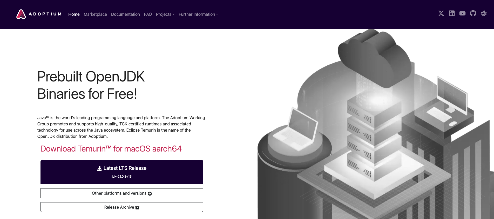
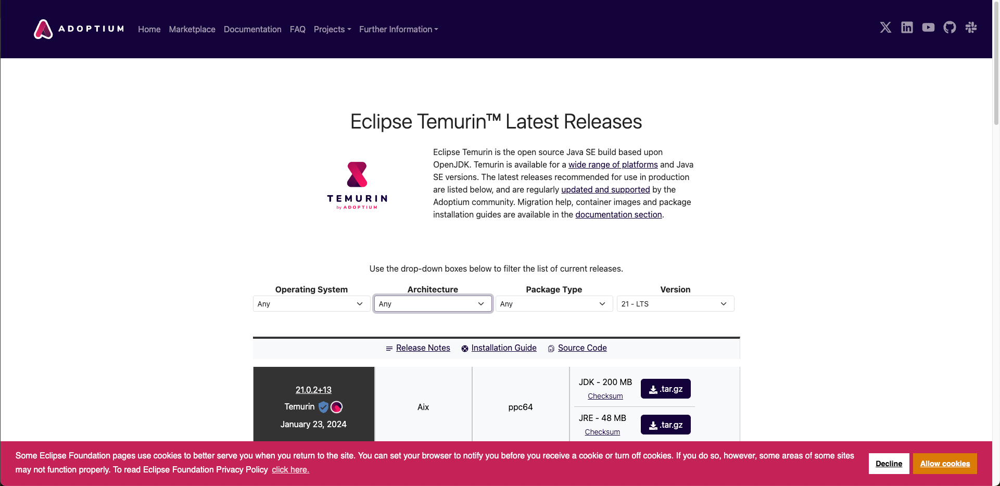

# JDK 설치

## 1. Open JDK 사이트 선택
[1. 어답티움 (https://adoptium.net/✅)](https://adoptium.net/)  
[2. https://jdk.java.net/](https://jdk.java.net/)  
이클립스 재단에서 관리하는 1. 어답티움 사용하기, 2번 사용해도 됨  


## 2. 운영체제에 맞는 OS 선택

위 이미지에서 `Other platforms and versions` 선택


## 다운로드
17버전 선택

|운영체제|설치 파일명|
|-|-|
|Windows x64|OpenJDK17-jdk_x64_windows_hotspot_17.0.3_7.msi|
|macOS x64(Intel Chip)|OpenJDK17-jdk_x64_mac_hotspot_17.0.3_7.pkg|
|macOS aarch64(Apple M1 Chip)✅|OpenJDK17-jdk_aarch64_mac_hotspot_17.0.3_7.pkg|


## MacOS 환경변수 설정
다른 JDK 버전이 존재할 경우 환경변수 설정  
JDK 설치 위치: `/Library/Java/JavaVirtualMachines/temurin-17.jdk`  

<br>

1-1. 사용자 홈 디렉토리에서 `$ ls -all` 명령어로 `.bash_profile` 찾아보기  
1-2. `.bash_profile`가 없다면 `$ touch .bash_profile` 명령어로 생성
```
$ touch .bash_profile
```

<br>

2-1 `.bash_profile` 내용을 적용하기 위해 텍스트 편집기로 다음 내용을 추가 후 저장
```
export JAVA_HOME=/Library/Java/JavaVirtualMachines/temurin-17.jdk/Contents/Home
export PATH=${PATH}:$JAVA_HOME/bin
```
2-2 숨김파일 보기: `shift + command + .`

<br>

3-1 `~/.bash_profile` 내용을 적용하기 위한 명령어 실행
```
$ source ~/.bash_profile
```

<br>

4-1 환경 변수 설정 확인 명령어
```
$ javac -version
```