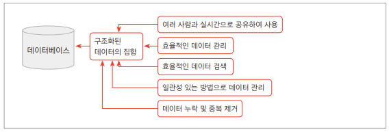
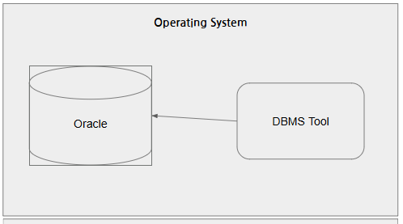
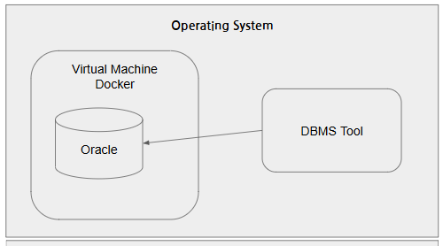
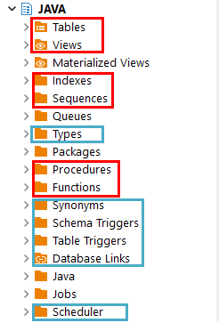
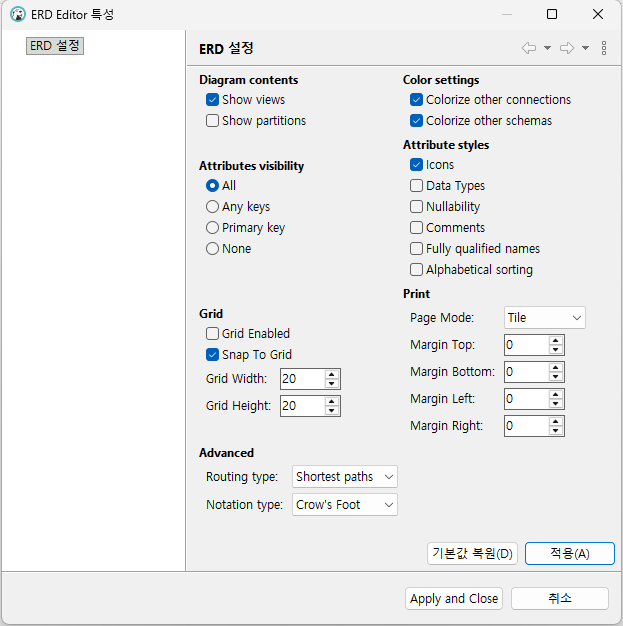
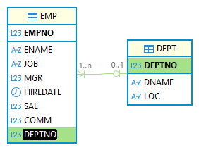
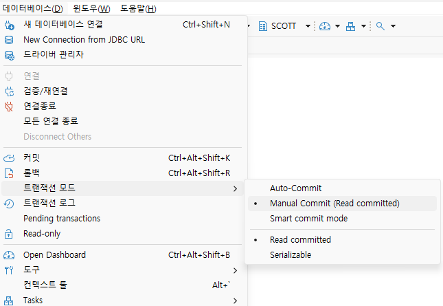
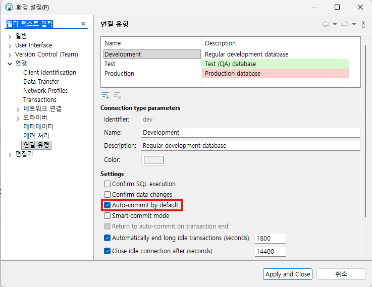

# JAVA

## Day01

### 프로그래밍이란
사용자에 요구에 맞춰 데이터를 처리하는 것

### 데이터/정보

데이터: 단순한 컴퓨터 환경의 특정 값을 의미  
정보: 데이터의 의미를 부여

### 데이터베이스
데이터를 기반으로 하는 관리 시스템, 데이터를 모아둔 장소를 의미
- DataBase Management System: DBMS
- DBMS를 줄여 DB
- 대부분 기업의 `도메인 정보`를 저장하고 있음  


### 데이터베이스 종류
- 관계형 데이터베이스(RDBMS)
    - Oracle
    - SQLServer
    - MySQL
    - MariaDB
    - PostgreSQL

- NoSQL 데이터베이스(빅데이터...)
    - Radis
    - MongoDB
    - Apache Cassandra

- In-Memory 데이터베이스
    - SAP HANA(빠름)

### 오라클 설치 방법
1. 로컬 설치  


2. 도커 설치  


### 오라클 설치이전
1. 도커 설치
    - https://www.docker.com/
    - Download Docker Desktop
        - Download for Windows – AMD64
        
2. 설치 후 실행
    - settings 
        - Start Docker Desktop when you sign in to your computer

### 오라클 설치
1. Docker Command 사용
    - Powershell 오픈 후 도커 실행 확인
        ```bash
        docker --version
        ```
    - 이미지 검색
        ```bash
        docker search oracle-xe
        ```
    - 이미지 다운
        ```bash
        docker pull gvenzl/oracle-xe:21-slim
        ```
    - 컨테이너 실행
        ```bash
        docker run -d --name oracle-xe -p 1521:1521 -e ORACLE_PASSWORD=비밀번호 gvenzl/oracle-xe:21-slim
        ```
    - 컨테이너 내부 접속
        ```bash
        docker exec -it oracle-xe sqlplus 계정/비밀번호@XE
        ```
        
    - Container DB 모드 확인 방법
        ```sql
        SELECT * FROM v$database;
        ```
    - 강의용 사용자 생성
        ```sql
        CREATE USER java IDENTIFIED BY java12345;
        GRANT CONNECT, RESOURCE TO java;
        GRANT CREATE TABLE TO java;
        GRANT all privileges TO java; -- INSERT 등 추가권한 할당
        ```

### 데이터베이스 개발 툴 DBeaver 설치
1. 개발 툴 종류
    - SQL*Plus - 콘솔 개발 화면, 가장 기초적인 SQL 실행도구, 사용 불편리함
    - Oracle SQL Developer - 오라클에서 제공하는 무료툴, 오픈소스, java 개발 툴 Eclipse를 커스텀해서 개발
    - Toad for Oracle - DB 개발 툴, 가장 강력한 SW, 상용 라이선스
    - DBeaver - 오픈소스, 거의 모든 DB를 사용, 대중성이 높음

2. DBeaver 설치
    - https://dbeaver.io/

    #### DBeaver 사용법
    - Database Navigator에서 DB연결 시작
    - 우클릭 -> create -> connection
    - 연결 정보 입력 -> test connection -> 완료
    - 주의사항: port 번호 확인, Database 이름 확인, Usernmae과 Password 일치

3. VSCODE EXTENSIONS
- Database Client  

- 설정 후 save -> connect

### 기본 사용법
- DBeaver
    - 연결된 XE - java -> Schema(Database와 같은 의미) 확장 -> JAVA 선택 -> SQL 편집기
- 샘플 DB 생성, 시퀀스 생성

    1. 테이블 생성: [쿼리](./code/day01/1.sample_schemas.sql)
    2. 시퀀스 생성: [쿼리](./code/day01/2.sequences.sql)
    3. 부서데이터 생성: [쿼리](./code/day01/3.department.sql)
    4. 직원데이터 생성: [쿼리](./code/day01/4.employee.sql)
    5. 고객데이터 생성: [쿼리](./code/day01/5.customer.sql)
    6. 상품데이터 생성: [쿼리](./code/day01/6.product.sql)
    7. 주문과 주문상세 데이터 생성: [쿼리](./code/day01/7.order_order_item.sql)

- 간단 연습: [쿼리](./code/day01/8.샘플쿼리.sql)
    - DB 파일은 확장자를 .sql
        - 근데 .sql이랑 .txt랑 차이 없음
        - ;으로 끝나는 하나의 명령을 query라고 함
        - 쿼리문은 대소문자 구분 없음

- SQL(Structured Query Language)
    - 구조화된 질의 언어
    - 관계형 데이터베이스에서 DBMS 상에 데이터를 정의, 조작, 제어하기 위해 사용하는 표준 프로그래밍 언어

## Day02

### DBeaver 사용법, 작업 시 사전지식
- 메뉴 상 용어
    - 검색 -> `DB Full-Text` = Full Text Search(대용량 데스트 내에서 필요한 단어를 검색할 때)
    - SQL 편집기 -> `실행계획` -> 현재의 쿼리가 실행되는데 비용이 얼마나 발생하는지 파악하는 기술, 최적화 실행속도 빠르게 하기전에 분석
    - 데이터베이스 -> `트랜잭션` 모드 -> 쿼리들이 실행되는 논리적 덩어리, Auo-Commit(좀 위험), None Commit  
    

### SELECT 문

- 문법 이전 데이터 타입 일부
    - NUMBER: 숫자타입, 최대 22byte
    - INTEGER: 정수타입, 모든 데이터의 기초 4byte(-21억 ~ 21억)
    - FLOAT: 실수타입, 소수점 포함, 최대 22byte
    - CHAR(n): Character 문자열 타입, 고정형, 최대 2000byte
        - CHAR(20) 기준 'Hello world'를 저장하면, 'Hello world&nbsp;&nbsp;&nbsp;&nbsp;&nbsp;&nbsp;&nbsp;&nbsp;&nbsp;'로 저장됨
        - 무조건 자리수를 20자리로 고정해서 생성
    - VARCHAR2(n): 가변형 문자형, 최대 4000byte
        - 오라클에서 VARCHAR(n)는 사용안함
        - VARCHAR2를 20으로 'Hello world'를 저장하면, 'Hello world' 뒤에 9자리는 버림
    - LONG(n): 가변길이 문자열, 최대 2Gbyte
    - LONG RAW(n): 바이너리(이진) 데이터, 0과 1의 숫자로만 저장, 최대 2Gbyte
    - CLOB: 대용량 텍스트 타입, 최대 4Gbyte
    - BLOB: 대용량 바이너리 타입, 최대 4Gbyte
    - DATE: 날짜 타입, 문자열과 다름

- 데이터 조회 3가지 방법 - [쿼리](./code/day02/1.데이터조회방법.sql)
    - 셀렉션(Selection): 행 단위 조회
    - 프로젝션(Projection): 열 단위 조회
    - JOIN: 두 개 이상 테이블을 조합하여 조회

- SELECT 문법
    - 기본쿼리, 별명 - [쿼리](./code/day02/2.기본쿼리%20및%20별명지정쿼리.sql)
    - 중복제거 - [쿼리](./code/day02/3.중복제거.sql)
    - 정렬 - [쿼리](./code/day02/4.정렬쿼리.sql)
    - WHERE절 - [쿼리](./code/day02/5.조건쿼리.sql)

    ```sql
    -- 한 줄 주석
    /* 여러 
        줄 주석 */

    -- 기본 문법
    SELECT [*|열이름 나열] FROM [dual|테이블명];

    -- 별명추가
    SELECT 컬럼명 [AS 별명],
           계산식 as "별명",
           ...
      FROM 테이블명 [테이블별명];

    -- 데이터 정렬
    SELECT 위와동일
      FROM 테이블명
    ORDER BY [정렬할 열이름(여러개)][ASC|DESC];
    /*
    ASC: ascending(오름차순)
    DESC: descending(내림차순)
    ASC는 기본값이고 생략 가능
    */

    -- 조건절 WHERE절
    -- 원하는 조건으로 다양하게 조회할 때
    SELECT 위와동일
      FROM 테이블명
    [WHERE 조회할 행을 판별하는 조건식]
    [ORDER BY [정렬할 열이름(여러개)][ASC|DESC]];
    ```

- SELECT 연산 - [쿼리](./code/day02/6.연산자.sql)
    ```sql
    -- 산술연산자 + - * /
    -- 비교연산자 > < >= <= == <>
    -- 논리 부정 연산자 NOT
    -- IN = OR과 동일
    -- BETWEEN
    -- UNION
    -- UNION ALL
    ```

- 오라클 함수 - [쿼리](./code/day02/8.오라클함수.sql)
    - 문자열 함수
        - `UPPER`(모두 대문자), `LOWER`(모두 소문자), `INITCAP`(첫 글자만 대문자)
        - `LENGTH`(문자열 길이)
        - `SUBSTR`(문자열, 시작, 길이)
        - `INSTR`(문자열, 찾을 문자열, [횟수]), 문자열에서 찾을 문자열의 위치를 리턴
        - `REPLACE`(문자열, 찾을문자열, 바꿀문자열), 찾은 문자열을 바꿀문자열로 변경
        - `LPAD`(문자열, 자리수, 채울문자열), `RPAD`(문자열, 자리수, 채울문자열), L/R 기준으로 자리수만큼 빈공간을 특정문자로 채우기
            - 날짜에서 1~9까지 한 자리일 때 자리 채울때 사용(01~09)
        - `CONCAT`(앞쪽문자열, 뒤쪽문자열), 두 문자열 합치기
        - `TRIM`(공백이있는문자열), `LTRIM`(공백이있는문자열), `RTRIM`(공백이있는문자열), 문자열 앞뒤의 빈공백 제거

    - 숫자 함수
        - `ROUND`(반올림할수, 반올림위치)
        - `CEIL`(올림할숫자)
        - `FLOOR`(내림할수)
        - `TRUNC`(숫자, 버림위치)
        - `MOD`(나머지를구할수)


### DB 특징
- 모든 언어는 index가 0부터 시작
- 단, `데이터베이스는 인덱스 1부터` 시작

## Day03
### 함수
- 날짜 포맷 단어
    - YYYY, YY
    - MM, MON, MONTH
    - DD, DDD, DY, DAY
    - HH24, HH, HH12
    - MI
    - SS
    - AM, PM
- 오라클 함수
    - 날짜 함수 - [쿼리](./code/day03/1.오라클함수.sql)
        - `sysdate`: 기본, 현재 일시 반환
        - ADD_MONTHS(날짜컬럼, 정수): 양수는 이후 달, 음수는 이전 달
        - MONTHS_BETWEEN(비교날짜1, 비교날짜2): 두 날짜 사이의 개월 수
        - NEXT_DAY(날짜, 요일): 날짜 이후의 해당요일 날짜 반환
        - `LAST_DAY()`: 해당 날짜 달의 마지막일 리턴
    - 형변환 함수
        - TO_CHAR(날짜, '날짜포맷'): 날짜를 해당 포맷에 맞게 변경해서 표현
        - TO_CHAR(숫자, '숫자포맷'): 숫자를 해당 포맷에 맞게 변경 표현
        - TO_NUMBER(숫자로만된문자데이터, '숫자포맷'): 수로 된 문자열을 숫자로 변경
        - TO_DATE(날짜형식문자데이터, '날짜포맷'): 문자데이터를 날짜데이터로 변경
    - NULL, 처리함수 - [쿼리](./code/day03/2.NULL함수.sql)
        - NULL(데이터없음)은 일부 개수 처리나 통계 불가, NULL값 처리
        - NVL(널이들어간데이터, 널처리): 해당 값이 NULL이면 보통 0으로 변환
        - NVL2(널이들어간데이터, 널이아닐때처리, 널일때처리): 널이 아닐 때와 널일 때로 나눠서 처리
    - DECODE, CASE - [쿼리](./code/day03/3.decode_case.sql)
        - 특정 열의 데이터가 어떤 데이터인지에 따라 다르게 처리할 때
        - `DECODE`(컬럼, 조건, 결과, ...): 오라클 전용함수
        - CASE문: CASE ~ WHEN ~TEHN ~ END ...

### 다중행, 데이터 그룹화
- 다중행(그룹) 함수 - [쿼리](./code/day03/4.다중행함수.sql)
    - 여러 행의 데이터를 바탕으로 하나의 결과를 도출하는 함수
    - SUM(): 데이터의 합, 급여, TAX, 점수 등 의미있는 데이터만 합할 것
    - COUNT(): 데이터의 개수, NULL 영향 받음, 데이터 형에 영향 받지 않음, *(ALL)도 가능
    - AVG(): 데이터의 평균, NULL에 영향을 받기 떄문에, NULL 값은 0으로 변경 후 계산해야됨
    - MIN(): 데이터 중 최소값, 날짜, 문자열도 가능
    - MAX(): 데이터 중 최대값, 날짜, 문자열도 가능
- 그룹화 - [쿼리](./code/day03/5.그룹화.sql)
    ```sql
    SELECT [~], 다중행함수
        FROM [테이블명|dual]
      WHERE [조건식]
    GROUP BY [그룹화할열지정] [ROLLUP|CUBE|GROUPING SETS]
    ORDER BY [정렬조건]
    ```
    - 그룹화 시 유의점
        - SELECT 절에 다중행 함수 외 일반 컬럼을 사용하고자하면, 반드시 GROUP BY 절에 일반 컬럼이 들어가 있어야 한다
- HAVING절
    - 일반 SELECT절의 조건은 WHERE로 처리
    - 다중행 함수 등의 조건은 HAVING절로 처리해야 함
    - 다중행(그룹) 함수는 WHERE절에 사용불가

- 그룹화 관련 함수 - [쿼리](./code/day03/6.그룹화2.sql)
    - ROLLUP: 해당 컬럼별 합계 도출
    - CUBE: 해당 컬럼별 상세 소계 도출
    - GROUPING SETS
    - PIVOT: 일반 데이터(세로출력)을 가로출력으로 변경

### Sample DB 생성
system계정에서  
```sql
-- 사용자 생성
CREATE USER sample IDENTIFIED BY java12345;

-- 권한(grant privileges)
-- DBA 권한: 주의요망
GRANT CONNECT, resource, dba TO sample;
```

파워쉘에서 docker 실행
```bash
docker exec -it oracle-xe sqlplus sys/oracle as sysdba
```

```sql
alter session set "_oracle_script"=true;

create user scott identified by tiger
default tablespace users quota unlimited on users;

grant connect, resource, dba to scott;
```

```sql
conn scott/tiger
show user
```

```sql
alter session set "_oracle_script"=true;
alter session set nls_date_language='american';
alter session set nls_date_format='dd-MON-rr';
```

### 조인
#### 엔티티 관계  
테이블 -> 다이어그램 보기 -> 설정 -> Notation type 변경

- 조인 기본 - [쿼리](./code/day03/7.조인.sql)


## Day04
- 관계형 데이터베이스
    - 관련된 데이터를 테이블 형태로 저장하고, 테이블간 관계를 통해 데이터를 관리하는 DB 모델
    - 테이블: 데이터를 저장하는 구조, 엔티티
    - 행: 관련 데이터가 모두 모인 하나의 데이터, `레코드`, `row`, tuple
    - 열: 데이터 특징을 담는 하나의 속성, `컬럼`, `Attribute`
    - PK: 각 행의 유일하게 식별하는 키, 여러 개의 PK를 가질수도 있다, Primary Key, 기본키
    - FK: 부모 테이블의 PK와 관계를 맺는 키, Foreign Key, 왜래키
- ERD(Entity Relationship Diagram)
    - 관계형 데이터베이스 구조를 그림으로 표현한 설계도
    - 데이터베이스를 만들기 전에 어떤 테이블이 필요하고 어떤 관계를 맺어야 하는지 시각적으로 표현  
    
    - PK: `EMP.DEPTNO`, `DEPT.DEPTNO`
    - FK: `EMP.DEPTNO`
    - 일반컬럼: 그 외 나머지 컬럼들
    - 부자관계 - DEPT(부), EMP(자)

### 조인
- 조인 - [쿼리](./code/day04/1.조인복습.sql)
    - 내부 조인: `INNER JOIN`, EQUI JOIN
    - 비등가 조인: 등가조인 외의 방법, Between등 사용
    - `셀프 조인`: 자기 테이블을 조인, 자기 테이블 내에 PK외 FK가 지정되어 있어야 함
        - 대부분 회사에서 조직도, 상사와 부하직원 관계를 볼 때 사용
        ```sql
        SELECT *
            FROM EMP e1, EMP e2
        WHERE e1.mgr = e2.EMPNO;
        ```
        - 나오지 않는 관계도 보고 싶은 경우 `(+)` 사용
        - `(+)` 위치 주의
        ```sql
        SELECT e1.empno, e1.ename, e1.MGR 
            , e1.HIREDATE
            , e2.EMPNO AS mgr_empno
            , e2.ename AS mgr_ename
            FROM EMP e1, EMP e2
        WHERE e1.mgr = e2.EMPNO (+);
        ```
    - `외부 조인`: 내부조인의 반대, OUTER JOIN 조인 기준에서 일치하지 않는 데이터도 나오도록 조회
        - `LEFT OUTER JOIN`: 왼쪽 테이블 기준, 오른쪽 테이블에 일치하지 않는 데이터 조회
        - `RIGHT OUTER JOIN`: 오른쪽 테이블 기준, 왼쪽 테이블에 일치하지 않는 데이터 조회
- SQL-99 표준문법 조인 - [쿼리](./code/day04/2.표준조인.sql)
    - JOIN ~ ON, INNER JOIN ~ ON: 내부 조인 (INNER) 생략 가능
    - LEFE|RIGHT OUTER JOIN ~ ON: 외부 조인

### 서브쿼리
- 서브쿼리 - [쿼리](./code/day04/3.서브쿼리.sql)
    - 메인쿼리 내에 소괄호()로 포함된 추가쿼리, SubQuery
    - 대부분 조인으로 변경 가능
    - 대부분 서브쿼리부터 작성 추천
- 서브쿼리 종류
    - 단일행 서브쿼리: 비교연산자로 서브쿼리 사용
    - 다중행 서브쿼리
        - IN: 메인쿼리 데이터가 서브쿼리 결과 중 하나라도 일치하는 데이터가 있으면
        - ANY: 메인쿼리의 조건식을 만족하는 서브쿼리의 결과가 하나 이상이면
        - ALL: 메인쿼리의 조건식을 서브쿼리의 결과 모두가 만족하면
        - EXISTS: 서브쿼리의 결과가 존재하면(행이 1개 이상인 경우)
    - 다중열 서브쿼리: 서브쿼리 결과가 여러 컬럼일 때 
    - FROM절 서브쿼리: 가상의 테이블을 생성
    - SELECT절 서브쿼리: 스칼라 서브쿼리, JOIN으로 변경 가능

### DML
- SQL문은 DML, DDL, DCL, TCL 구성
    - Data Manipulation Language
    - Data Definition Language
    - Data Control Language
    - Transaction Control Language
- DML - [쿼리](./code/day04/4.DML.sql)
    - 데이터 조작 언어: 데이터를 추가, 변경, 삭제, 조회하는 쿼리 명령어
    - SELECT: 조회용
    - INSERT: 생성(추가)용
        ```sql
        INSERT INTO 테이블명 (열1, 열2, ...) VALUES (열1값, 열2값, ...);
        ```
    - UPDATE: 변경(수정)용, `주의~`
    - DELETE: 삭제용, `주의!`
    - SELECT는 저장된 데이터의 변경 없음, 오직 조회만
    - SELECT는 트랜잭션이 없고, 나머지는 트랜잭션이 매우 중요

    
## Day05
### DML
- INSERT: 데이터 생성 - [쿼리](./code/day05/1.INSERT.sql)  
    **이거 중요하다고 봄**
    ```sql
    -- SELECT 결과를 그대로 테이블에 추가가능
    INSERT INTO 테이블명 (열1, 열2, ...) 
    SELECT 열1, 열2, ...
    [WHRER 조건절]
    [기타 SELECT 문]
    ```    

- UPDATE: 데이터 수정 - [쿼리](./code/day05/2.UPDATE_DELETE.sql)
    - 기본 문법의 WHERE절은 무조건 작성, WHERE절 없는 수정문 주의
    - WHERE절에는 제약조건 PK가 우선 작성
    ```sql
    UPDATE 변경할테이블
        SET 열1-변경값, 열2=변경값, ... -- 변경할 열값만 추가
    WHERE 데이터변경 대상행을 선별하기 위한 조건 -- 중요
    ```

- DELETE: 데이터 삭제
    - WHERE 절을 빼는 경우 조심
    ```sql
    DELETE FROM 테이블
        WHERE 삭제할대상행 선별하는 조건 -- 중요
    ```

### TCL
- 트랜잭션 - [쿼리](./code/day05/3.트랜잭션.sql)
    - 논리적으로 처리되는 쿼리들의 집합
    - 여러 개 테이블에 조회, 수정, 삭제 등이 이뤄지는 논리 덩어리
    - All or Nothong

- 트랜잭션 설정: Oracle은 트랜잭션을 시작하는 `BEGIN TRAN[SACTION]`이 없음
    - 첫 번째 쿼리부터 트랜잭션이 시작됨
    - DBeaver의 경우 메뉴 -> 데이터베이스 -> 트랜잭션 모드 -> Manual Commit 변경
      
    - 환경 설정 -> 연결 -> 연결 유형 -> `Auto-commit by default` 해제
      

- 트랜잭션 명령어
    - `COMMIT`: 영구 반영
    - `ROLLBACK`: 트랜잭션 취소
    - `SAVEPOINT`: 트랜잭션 중간 저장

- 세션 - [쿼리](./code/day05/4.세션.sql)
    - 하나의 연결로 접속해서 종료까지 기간

- 락
    - 세선 별로 트랜잭션이 문제발생하지 않도록 데이터를 잠그는 원리


### DDL
- 데이터 정의어
    - 데이터베이스 객체 생성, 변경, 삭제하는 명령어
- DDL 명령어 - [쿼리](./code/day05/5.DDL.sql)
    - CREATE: 객체 생성, 대부분 테이블 생성시 사용
        ```sql
        CREATE [TABLE|DATABASE|VIEW|등 객체타입] [객체 생성시 필요한 문법];

        -- 테이블 생성
        CREATE TABLE 소유자.테이블명 (
            열1이름 자료형,
            열2이름 자료형,
            ...
            열N이름 자료형[,]

            [각 제약조건]
        );
        ```
    - ALTER: 객체 수정, 생성과 달리 수정할 수 있는 객체가 많이 없음
        ```sql
        -- 테이블 수정
        ALTER TABLE 테이블명
            ADD 열이름 자료형;
            RENAME COLUMN 열이름 TO 새열이름;
            MODIFY 열이름 변경자료형;
            DROP COLUMN 삭제할열이름;
        ```
    - DROP: 객체 삭제, ALTER와 달리 대부분 객체에서 사용가능
        - 테이블 등이 통채로 삭제되면 데이터 삭제됨
        ```sql
        DROP 객체타입 객체명;
        ```
    - RENAME: 객체 이름변경, 자주 사용하지 않음
        ```sql
        RENAME 이전객체명 TO 새객체명
        ```
    - TRUNCATE: 객체 내 데이터 모두 삭제, 대부분 테이블에서 진행
        ```sql
        -- DELETE FROM 테이블명과 동일, 단 트랜잭션이 발생하지 않아 복구 불가
        -- 테이블 생성 이후 상태가 됨
        TRUNCATE TABLE 테이블명
        ```

## Day06
### DDL
- DDL 명령어 - [쿼리](./code/day06/2.DDL.sql)

### 객체
 - [쿼리](./code/day06/3.Object.sql)
- 데이터 사전: 일반 테이블 외 DB를 운영하는데 필요한 특수 테이블
    - USER_XXXX: 현재 DB에 접속한 사용자가 소유한 객체 정보
    - ALL_XXXX: 사용허가를 받은 객체 정보
    - DBA_XXXX: DB 관리를 위한 정보(SYSTEM, SYS 사용자만 접근 가능)
    - V$_XXXX: DB 성능 관련 정보
- `인덱스`
    - Full Table Scan: 모든 테이블의 데이터를 처음부터 끝까지 찾아서 데이터 조회
    - Index Scan: 인덱스를 찾아서 해당 데이터를 조회
    - 실제 DB에 5% 정도 용량이 추가됨, 인덱스 데이터를 저장해야 하기 때문
    - 일정 시간마다 인덱스를 재정리, 데이터가 쌓여가는 중간에도 재정리(시간소요)
    - 보통 SELECT WHERE 절에서 자주 필터링 되는 컬럼에 인덱스를 걸면 속도가 개선됨
    - 대용량 데이터 (대략 몇 천만건)에서 속도개선을 위해 인덱스 사용
        ```sql
        -- 기본 문법
        CREATE INDEX 인덱스명
            ON 테이블명 (인덱스열 ASC|DESC,
                        인덱스열 ASC|DESC, 
                        ...);
        
        -- 삭제
        DROP INDEX 인덱스명;
        ```
- 인덱스 종류
    - 단일 인덱스: 하나의 컬럼에 거는 인덱스
    - 복합 인덱스: 두 개 이상 컬럼에 거는 인덱스
    - 고유 인덱스: 열에 중복 데이터가 없을 때
    - 비고유 인덱스: 열에 중복되는 데이터가 있을 때
    - 함수기반 인덱스: 산술식 등으로 가공된 값을 인덱스로 사용
    - 비트맵 인덱스: 데이터 종류는 적고 같은 데이터가 많이 존재할때 사용하는 인덱스
- 뷰
    - 가상 테이블을 만드는 객체
    - 물리적인 데이터를 따로 저장하지 않음
    - SELECT문의 복잡한 쿼리를 저장해서 간단하게 사용
    - 테이블의 특정 컬럼(민감한 급여, 보너스, 주민번호, 전화번호, ...)을 노출하지 않을 경우
    - 주의!: `보기위한 객체지만 한 테이블의 SELECT * 일 경우 INSERT 가능`
        ```sql
        -- 기본 문법
        CREATE [OR REPLACE] VIEW 뷰이름
            AS (저장할 SELECT문)

        -- 삭제
        DROP VIEW 뷰이름;
        ```
- 시퀀스
    - `오라클에만 존재하는 객체`
    - 순번을 자동으로 매겨주는 기능
        ```sql
        -- 생성
        CREATE SEQUENCE 시퀀스명
        START WITH n
        INCREMENT BY p
        [MAXVALUE m | NOMAXVALUE] -- NOMAXVALUE 10의 27승
        [MAXVALUE o | NOMINVALUE]
        [CYCLE | NOCYCLE]
        [CHCHE r | NOCACHE]

        -- 수정
        ALTER SEQUENCE 시퀀스명
        -- START WITH  이 외 모두 사용가능

        -- 삭제
        DROP SEQUENCE 시퀀스명
        ```
### 제약조건
- 제약조건 - [쿼리](./code/day06/4.제약조건.sql)
    - 테이블에 저장할 데이터를 정확하게 규제하는 특수한 규칙
    - 조건에 맞지 않는 데이터를 걸러내는 기능
- 종류
    - `NOT NULL`: 지정한 열에 NULL을 허용하지 않음, 무조건 데이터 입력해야 함
        - 데이터 중복 허용
    - `UNIQUE`: 지정한 열의 유일한 값이 되어야 함, 중복불가
        - NULL은 중복에서 제외
    - `PRIMARY KEY`: 지정한 열의 유일한 값이면서 NULL을 허용하지 않음
        - PK는 **UNIQUE**에 **NOT NULL**
        - PK를 지정하면 자동으로 UNIQUE 인덱스가 생성
    - `FOREIGN KEY`: 다른 테이블의 PK열을 참조하여 PK열에 존재하는 값만 입력가능
        - FK는 설계에 따라 NOT NULL(식별관계)일 수도 있고, NULL(비식별관계)일 수도 있음
        - 자식 테이블에서 PK로 지정할 수도 있음, 일반 컬럼으로 FK만 지정 가능
            - FK가 기본키면 NOT NULL
    - `CHECK`: 설정한 조건식에 일치하는 데이터만 입력가능
    - `DEFAULT`: 열에 데이터를 입력하지 않았을 때 기본값이 자동으로 입력
- 데이터 무결성
    - DB에 저장되는 데이터의 정확성과 일관성을 보장한다는 의미
    - 영역 무결성(적절한 형식의 데이터나 NULL 불가), 개체 무결성(PK개념), 참조 무결성(FK개념)
- CASECADE 계단식처리
    - 부모 테이블의 PK 컬럼 해당 데이터를 지우면, 자식 테이블의 FK에 참조 중인 레코드를 전부 지우는 기능
    - ON DELETE CASCADE: 부모 테이블 데이터를 지우면 자식 데이터도 삭제
    - ON DELETE SET NULL: 부모 테이블의 데이터를 지우면, 자식의 FK 데이터가 자동 NULL
