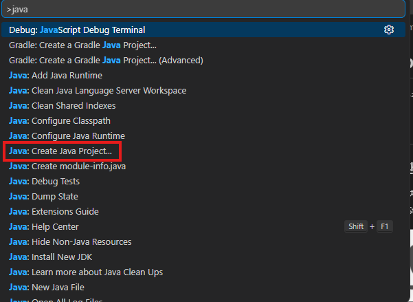
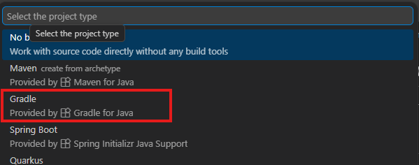
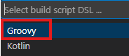
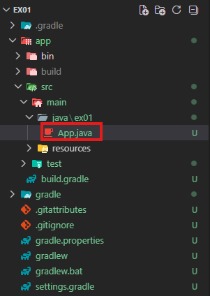

# java-springboot
Java 개발자과정 SpringBoot 리포지토리


## 1일차

### Java 개발환경 설정
1. java 설치

2. Visual Studio Code로 실행  


3. 명령 팔레트 오픈:  `ctrl + shift + p`

4. 폴더 선택  



5. DSL 선택  


6. Gradle 프로젝트 명 선택

7. Ctrl + F5로 실행  


### Java 실행 구조
- 컴파일(빌드) -> 실행
    - .java -> .class -> JVM 실행

- 중요 용어
    - JDK: Java Development Kit, 자바를 개발하려면 필수로 설치해야 하는 키트
    - JRE: Java Runtime Enviroment, JDK보다 작은 그룹, 자바를 실행할 수 있는 파일만 존재, 개발말고 실행만 하려면 JRE만 있어도 됨
    - JVM: Java Virtual Machine, 자바로 컴파일된 바이트코드를 실행시키는 가상 머신, JRE/JDK에 포함
        - OS 플랫폼 독립적으로 동작. 윈도우에서 개발한 Java도 리눅스 등에서 실행 가능

### 프로젝트 그룹
1. VS Code 개발 툴: 개발을 위한 모든 것이 포함
2. Java: 개발하기 위한 언어
3. JDK: 개발 Tool Kit
4. JVM: Java가 실행될 수 있는 환경
5. Gradle: JVM 상에서 동작하는 Java 빌드 도구, Java 프로젝트 환경자체를 거의 자동으로 구성
6. Java 폴더, 소스: Gradle이 설정한 필요 폴더와 위치에 파일들 배치

### 프로젝트 구조
```text
ex01/
 ├─ app/
 │   ├─ src/
 │   │   ├─ main/
 │   │   │   └─ java/
 │   │   └─ test/
 │   │       └─ java/
 │   └─ build.gradle 또는 build.gradle.kts
 ├─ settings.gradle 또는 settings.gradle.kts
 ├─ gradlew
 ├─ gradlew.bat
 └─ gradle/wrapper/
```
- build.gradle: Gradle 빌드 설정 파일. Java, SpringBoot 필요 라이브러리, 설정에 가장 중요한 설정 파일 
    - 플러그인 종류 선정
    - 의존성 추가
    - Java 버전 설정
    - 테스트 설정
    - 실행 설정
- settings.gradle: 프로젝트명, 멀티 프로젝트 구성 정의, 구성요소 정의
- src/main/java: Java에서 개발할 실제 소스 위치 폴더
- src/test/java: 테스트 코드 위치 폴더, Java는 코딩과 테스트를 동시에 진행
- gradlew, gradlew.bat: Gradle Wrapper 실행하는 파일
- DSL: Domain Specific Language, 특정 분야에 최적화된 프로그래밍 언어, Gradle 설정하는 언어를 지정
    - Groovy: build.gradle, 간결하게 사용가능, 작성방법 간단
    - Kotlin: build.gradle.kts로 파일 생성, 생산성, 코드 안정성 강점
- Kotlin: Java를 대체하는 언어, Java 기반, Kotlin은 안드로이드/iOS 동시 개발 가능

### 빌드도구
- 프로젝트 빌드, 자바 버전, 자바 의존성(라이브러리) 관리, 문서화, 프로젝트 전체 관리
    - Maven: 오래된 빌드도구, xml 기반, pom.xml
    - Gradle: Maven 단점을 잡아낸 빌드도구, 텍스트 문서기반, build.gradle로 관리
    

### 코드 구조
```java
package ex02_syntax;

public class App {
    public static void main(String[] args) {
        System.out.println("Hello, Java!");
    }
}
```
- TIP : Gradle for Java로 프로젝트 생성 후 src/test/java/.../AppTest.java 지우고 진행

### 변수/자료형
- 변수 - [소스](./day01/ex02_syntax/app/src/main/java/ex02_syntax/App.java)
    - 변하는 데이터를 담을 수 잇는 상자와 같은 개념
    - 변수명은 의미있는 단어의 조합: personalAccount, myList...

- 데이터 타입: Java에서 변수에 어떤 데이터를 넣을지 지정
    - int, long, flaot, double, char, String, boolean, ...
    - 데이터를 넣을 때의 실수를 줄이기 위한 방법

- 클래스 타입: java.****. 형태로 클래스로 만들어진 타입
    - 기본 자료형들을 클래스화 시킨 자료형도 존재: Integer, Float, Double, ...
    - List, StringBuffer, Map, Set, ...

- final
    - 한 번 지정된 값을 변경 불가하게 만드는 키워드

### 연산자
- 할당연산자
- 산술연산자
- 증감연산자
- 비교연산자
- 논리연산자
- 비트연산자
- 삼항연산자
- 문자열 연산자
- 연산자 우선순위
- instanceof: 객체 타입 확인

### 제어문
- if, switch case, for, while


## 2일차
### 객체지향
절차지향 방식의 문제점
- 학생 수가 늘어나면 관리가 매우 어려움
- 관련된 데이터가 흩어잠, 같은 형태의 변수 선언이 반복됨
- 학생 한 명의 정보를 하나의 단위(그룹)으로 다루기 힘듦
- 이름, 나이, 점수 사이의 관계가 드러나지 않음
```java
// 학생 1번 정보
String stdName1 = "Kim";
int stdAge1 = 20;
int stdScore1 = 95;

// 학생 2번 정보
String stdName2 = "Lee";
int stdAge2 = 21;
int stdScore2 = 100;
```

객체지향으로 해결 - [소스](./day02/ex04_oop/app/src/main/java/ex04_oop/App.java)
- 하나의 객체로 표현
- 학생을 하나의 단위로 핸들링
```java
// 객체지향 방식
class Student {
    String name;
    int age;
    int score;
}

// 객체지향은 그룹핑(단위 묶음)
Studnet std1 = new Student();
std1.name = "Kim";
std1.age = 20;
std1.score = 95;
```

```java
// 객체 활용방법
List<Student> studnes = new ArrayList<>();

// 데이터 추가, 여러 데이터를 쉽게 추가가능
studnes.add(new Student("enough", 29, 100));
studnes.add(new Student("build", 30, 99));
studnes.add(new Student("add", 31, 98));
```

### 클래스와 객체
- 클래스
    - 객체(Object)를 만들기 위한 설계도
    - 클래스: 학생 설계도 / 객체: 각 한 생 한 명
    ```java
    class Student {
        String name;
        int age;
    }
    ```
    - 이 상태는 아직 실제 학생이 아님, 설계만 존재

- 객체(Object)
    - 클래스를 바탕으로 실제 메모리에 생성된 대상
    ```java
    // Student: Integer, Long과 같은 타입
    // std1: 변수명
    // new: 인스턴스
    // Student(): 생성자
    Student std1 = new Student();
    ```
    - 순서
    1. Student 타입의 객체를 생성
    2. 메모리(힙)에 Student 객체를 위치
    3. 객체의 주소를 s1에 참조(reference)

### 필드와 메서드
- Field
    - 멤버 변수, 멤버 필드: 클래스에 속한 변수
    - 객체가 가지는 데이터
    - 클래스 내에 선언한 변수
    - 일반 변수와 사용법 동일
    ```java
    class Student {
        String name;
        int age;
    }
    ```
- Method
    - 멤버 메서드: 클래스에 속한 메서드(함수)
    - 객체가 수행할 수 있는 동작
    - 일반 함수와 동일
    ```java
    class Student {
        String name;
        int age;

        void introduce() {
            System.out.println("학생이름: " + name + ", 나이: " + age);
        }
    }
    ```

- return이 있는 메서드 vs 리턴이 없는 메서드
    - 메서드명 앞에 return 되는 타입을 지정해야 함
    ```java
    int getIntVal() {
        return 10;
    }

    float getFloatVal() {
        return 3.14f;
    }

    boolean getTrue() {
        return false;
    }

    void printHello() {
        System.out.println("Hello");
    }
    ```

- 클래스 내에 메서드를 넣는 이유
    - 학생에 대한 동작은 학생 클래스 안에서 하는 것이 자연스러움
    - 데이터와 기능을 묶는 것이 객체지향의 핵심

- 생성자(Contructor)
    - 객체가 생성될 때 자동으로 호출되는 특별한 메서드, Python의 `__init__` 과 동일
    ```java
    class Stduent {
        String name;
        int age;

        Student() { // 클래스 명과 동일한 메서드
            System.out.println("Stduent 객체 생성");
        }
    }

    Student std1 = new Student();
    ```
    - 생성자 특징
        - 클래스 이름과 동일
        - 반환형이 없음
        - 객체 초기화에만 사용
        - 객체 만들 때 필수 데이터를 강제화
        - 잘못된 상태의 객체 생성을 줄임

- 매개변수 생성자(추가 생성자)
    - 초기화 시 인자를 받아서 객체 생성하는 방법이 필요할 때
    - 코드 양을 줄일 수 있고, 간단함

- this 키워드
    - Python의 `self`와 유사 기능
    - 멤버변수와 파라미터 이름이 같을 때 구분을 위해 사용

### 접근제한자, 캡슐화
- 코드 위험성
    ```java
    // 계좌 정보 클래스
    class Account { // 계좌 클래스
        int balance; // 잔고
    }
    ```
    - 위 코드는 언제든지 balance에 접근 가능
- 캡슐화
    - 객체 내부의 데이터를 외부에서 마음대로 바꾸지 못하게 막고, 정해진 방법으로만 접근 가능하게 만드는 것
    ```java
    class Account { // 계좌 클래스
        private int balance; // 잔고

        // 입금 메서드에서만 입금 가능
        public void deposit(int amount) {
            if (amount > 0) {
                this.balance += amount;
            }
        }

        // 출금 메서드에서만 출금 가능
        public void withdraw(int amount) {
            if (amount > 0 && this.balance >= amount) {
                this.balance -= amount;
            }
        }

        // 잔고 확인 메서드에서만 잔고 확인 가능
        public int getBalance() {
            return this.balance; 
        }
    }
    ```
    - private: 외부에서 접근 불가, 내부에서만 접근
    - public: 어디서나 접근 가능, 외부에서도 접근 가능
    - getter: 위에선 getBalance()
    - setter: 위에선 deposit()과 withdraw()

    | 접근제한자   | 동일 클래스 | 동일 패키지 | 자식 클래스 | 외부 전체 |
    | :---------- | :----: | :----: | :----: | :---: |
    | `private`   |    O   |    X   |    X   |   X   |
    | `default`   |    O   |    O   |    X   |   X   |
    | `protected` |    O   |    O   |    O   |   X   |
    | `public`    |    O   |    O   |    O   |   O   |

- static
    - 정적, 객체마다 따로 존재하는 것이 아니고, 클래스에 하나만 존재하는 멤버
    - 클래스의 경우 new로 객체를 생성하지 않음
    - 메서드의 경우도 객체 생성없이 사용가능
    - 메모리 할당을 한 번만 하고, 공유해서 사용할 수 있음
    - static void main: 프로그램이 시작되면 메서드 영역에 적재됨, 프로그램 종료 시 해제됨
    - 객체 인스턴스 변수를 사용할 수 없다.
    - static를 자주 사용하지 말 것

### 상속
- 기존 클래스의 필드와 메서드를 물려받아 새로운 클래스를 만드는 것
    ```java
    class Animal {
        String name;
        
        void eat() {
            System.out.println("먹는다");
        }
    }

    class Dog extends Animal {
        // Animal이 갖고 있는 name과 eat() 사용가능
        void bark() {
            System.out.println("멍멍!");
        }
    }
    ```
    - 공통 기능 재사용, Animal이 가지고 있는 모든 특성을 다 사용하면서 Dog의 특징을 포함
    - 부모 클래스(Super Class): Animal
    - 자식 클래스(Sub Class): Dog
    - is-a 관계: Dog is an Animal

### 메서드 오버라이딩
- 상속 받은 클래스에서 부모 클래스의 메서드를 자기 방식으로 다시 정의해서 사용하는 것
    ```java
    class Animal {
        void sound() {
            System.out.println("동물 소리"); // 부모 클래스의 메서드
        }
    }

    class Dog extends Animal {
        @Override
        void sound() {
            System.out.println("멍멍");
        }
    }

    class Cat extends Animal {
        @Override
        void sound() {
            System.out.println("야옹");
        }
    }
    ```

### @ Annotation
- 자바 파일을 컴파일 시, 어노테이션을 감지해서 그에 따라 정해진 작업을 수행하는 도구
- @ 키워드로 컴파일러나 프로그램에 특별한 의미/정보를 전달하는 태그
- @Override: 상위 타입(부모 타입)의 메서드를 재정의 했음을 의미
- 어노테이션 종류
    - @Deprecated: 이제는 사용안할 메서드 지정
    - @SupressWarning: 컴파일러에게 경고 메시지 출력하지 말 것을 지정
    - @SpringBootApplication @Component @Service @Repository @Controller @RequestMapping ...

### 메서드 오버로딩
- 같은 이름의 메서드의 매개변수를 다르게 여러 개 정의
    ```java
    class PrintTool {
        void print(int x) {}
        void print(String s) {}
        // void print(int y) {} // 컴파일 오류
        void print(int x, int y) {}
    }
    ```

### this/super
- this: 자기 자신 지칭
- super: 부모 클래스 지칭
    ```java
    class Animal {
        String name = "동물";
    }

    class dog extends Animal {

        Dog() {
            super(); // 부모클래스의 생성자
        }

        String name = "강아지";

        void printName() {
            System.out.println(this.name); // 강아지
            System.out.println(super.name); // 동물
        }
    }
    ```

### 업캐스팅
- 부모 클래스 변수에 생성된 자식 객체를 할당하는 것
- 유연한 코드 기법
- instanceof 연산자: 타입 확인
    ```java
    // 업캐스팅
    Animal a1 = new Cat();
    a1.printName();
    a1.sound();

    // 다운 캐스팅
    // 자식 클래스로 다시 변환 전에 정확한 타입을 확인
    if (a1 instanceof Cat) {
        Cat c1 = (Cat)a1;
        c1.printName();
    }
    ```

### 추상 클래스
- 객체를 직접 만들지 않고, 공통 규칙과 공통 기능을 제공하는 클래스
    ```java
    abstract class Animal {
        String name;

        // 추상 메서드
        abstract void sound(); // 내부 구현을 하지 않는다

        // 구현도 가능
        void sleep() {
            System.out.println("쿨쿨");
        }
    }

    class Dog extends Animal {
        @Override
        void sound() {
            System.out.println("멍멍");
        }
    }

    // Animal ani = new Animal(); // Animal 객체 생성 불가
    ```
- 추상 클래스는 객체를 생성할 수 없다.
- 공통 기능은 넣고 싶고, 일부 동작은 자식마다 다르게 구현을 강제하고 싶을 때
- 자식이 반드시 구현해야 하는 메서드를 강제할 수 있다

### 인터페이스
- 인터페이스 - [소스](./day02/ex04_oop/app/src/main/java/ex04_oop/ICage.java)
- 클래스가 반드시 구현해야 하는 기능의 규약
- 규칙을 완전 통제, 통일할 수 있음
- 클래스의 한 종류, 상속이라 부르지 않고, 구현(implementation)라고 함
- 인터페이스는 인터페이스로 상속 가능
- 다형성을 더 강하게 활용할 수 있는 방법
- 상속과 별개로 사용가능
- 인터페이스는 개별 파일로 생성해야 함
- 인터페이스는 메서드 정의만 하고 구현은 못함, 인터페이스를 가져다 쓰는 클래스에서 정의된 메서드를 강제 구현해야함
    ```java
    // iCage 인터페이스를 가져다 쓰는 클래스는 반드시 아래의 메서드를 구현해야 함
    interface iCage {
        void checkIn();
        void checkOut();
    }

    class Cat extneds Animal implements iCage {
        @Override
        public void checkIn() {
            // ...
        }

        @Override
        public void checkOut() {
            // ...
        }
    }
    ```
- 비교 정리
    |항목|추상 클래스|인터페이스|
    |---|---|---|
    |상속/구현|extends(상속)|implements(구현)|
    |다중사용|단일 상속|다중 구현|
    |공통상태 보관|가능|제한적|
    |목적|공통상태 + 규칙|규칙 정의|

#### VS code 팁
- Code Snippet: 코드 문법을 자동 생성 해주는 기능

### 예외처리
- 비정상적 종료를 막기 위해서 안전하게 처리하고 흐름을 제어하는 방법
    ```java
    int a = 10/ 0; // ArithmeticException -> Divide by zero
    ```

    ```java
    try {
       int result = 10 / 0 ;
    } catch(Exception e) {
        System.out.println(e);
    } finally {
        System.out.println("예외 상관없이 실행");
    }
    ```
- 예외를 직접 발생
    ```java
    // ... 구현 중 예외를 발생시키고 싶으면
    throw new Exception("예외발생");
    ```
- 모든 예외 클래스이 조상 클래스는 Exception

### 참조개념

- 얕은 복사
  - 같은 메모리 주소를 참조. 같은 객체를 바라보고 있음
  - 객체지향 클래스로 된 변수들에서 많이 발생

```java
Student s1 = new Student();
s1.name = "유고";

Student s2 = s1;   // 얕은 복사
s2.name = "이지";
System.out.println(s1.name);   // 이지 출력
System.out.println(s2.name);   // 이지 출력
```

- 깊은 복사
```java
// 깊은 복사
Student s3 = new Student();
s3.name = "복이";

Student s4 = new Student();   // 깊은 복사
s4.name = s3.name;
s4.name = "애슐리";

System.out.println(s3.name);   // 복이
System.out.println(s4.name);   // 애슐리
```

### 파일 입출력
- 예제 -[소스](./day02/ex05_fileio/app/src/main/java/ex05_fileio/App.java)

### 의존성(Dependency)
- 한 클래스가 다른 클래스를 사용하는 관계(의존도)
- Car는 Engine에 의존한다
    ```java
    class Engine {
        void run() {
            System.out.println("엔진 동작");
        }
    }

    class Car {
        Engine engine = new Engine(); // 의존성 발생
        
        void drive() {
            engine.run();
        }
    }

    Car car = new Car(); // 엔진 클래스를 손댈 수 없음
    ```
- 문제 상황
    - 가솔린 엔진에서 전기 엔진으로 바꾸려면?
    - Car 클래스 코드를 다 뜯어고쳐야 함
- 해결 상황
    - 엔진을 밖에 두자
    - Dependency Injection(DI) 의존성 주입
    - 결합도를 낮추고, 응집도를 높임, 테스트 쉬움, 유지보수 간단
    ```java
    class Car {
        Engine engine;

        Car(Engine engine) {
            this.engine = engine;
        }

        void drive() {
            engine.run();
        }
    }

    Engine engine = new Engine();
    Car car = new Car(engine); // Engine 인스턴스를 Car에 주입한다
    ```

- IoC(Inversion of Control) 제어의 역전
    ```java
    Engine e = new Engine();
    Car c = new Car();

    // IoC
    Car c = Spring이 다 만들어줌;
    Car car = content.getBean(Car.class);
    ```
- 자동차도 만들고 엔진도 만들고(의존성), 엔진은 만든걸 사서 조립하면(DI), 다 만들어주면(IoC)

### lambda 함수
- 간단히 사용할 함수를 로직 내에서 생성하고 사용하는 방법
    ```java
        // 람다 함수
        iCalculator add = (int a, int b) -> a + b; // 아주 간단한 로직을 처리하는 함수
        int result = add.calc(5, 6);
        System.out.println("결과: " + result);
        
        interface iCalculator {
            int calc(int a, int b);
        }
    ```

## 3일차

### Object
- Java에서 모든 클래스의 부모 클래스(Root Class) - 파이썬도 동일
    - Integer, String 등 일반적인 클래스 포함
    - 개발자가 생성하는 클래스도 모두 Object를 상속해서 생성
    - 너무나 일반적이라 extends Object는 생략
    - 모두 Object로 형변환 가능

### 일반화 프로그래밍
- Python, JavaScript는 데이터 타입 지정없음 -> 아무런 데이터나 변수에 들어감
- Java, C#, C++ 등의 대부분의 객체지향 언어에서는 불가능
    ```java
        // Object의 문제점
        Box box = new Box();
        box.set("문자열"); // Object <- 문자열 할당
        box.set(1000);
        // box.set(true);

        String s = (String) box.get(); // 형변환 필요
        System.out.println(s);
    }

    class Box {
        Object value; // 멤버 필드, Object라서 어떤 타입이든지 받을 수 있음

        // setter
        void set(Object value) {
            this.value = value;
        }

        Object get() {
            return value;
        }
    }
    ```
    - Exception in thread "main" java.lang.ClassCastException 형변환 예외 발생
    - 매번 형변환

- Generic(일반화) 방식 - [소스](./day03/ex06_generic/app/src/main/java/ex06_generic/App.java)
    ```java
    class Box<T> { // 아무 타입이나 상관없음
        T value; // 멤버 필드, Object라서 어떤 타입이든지 받을 수 있음

        // setter
        void set(T value) {
            this.value = value;
        }

        T get() {
            return value;
        }
    }

    // 두 타입을 받는데 어떤 타입이든 될 수 있다
    class Pair<K, V> {
        K key;
        V value;
    }

    ...
    Box<String> box = new Box<String>();
    Box<String> box = new Box<>(); // 둘 다 가능


    Box<Number> box3 = new Box<>(); // Number 타입: 숫자 종류는 모두 받을 수 있는 클래스 타입
    box3.set(1000);
    box3.set(3.141592f);
    box3.set(30000000L);

    Pair<String, Integer> p1 = new Pair<>();
    Pair<Integer, Float> p2 = new Pair<>();

    p1.key = "Power";
    p1.value = 10000;

    p2.key = 9090;
    p2.value = 3.14f;
    ```
    - T: 모든 타입을 의미
    - R, K 등 아무 글자나 상관없음, 대신 통일만 시킬 것
- 일반화 제한
    - 특정 타입만 허용하는 방식
    ```java
    class Box<T extends Number> {
        //...
    ```
    - 타입을 숫자형 타입만 제한두겠다는 의미

- 일반화 정리
    - 타입은 나중에 결정
    - 타입을 마구 섞는게 아님
    - 안전하게 고정하여 사용하는 기술

---

[SpringBoot](./README2.md)