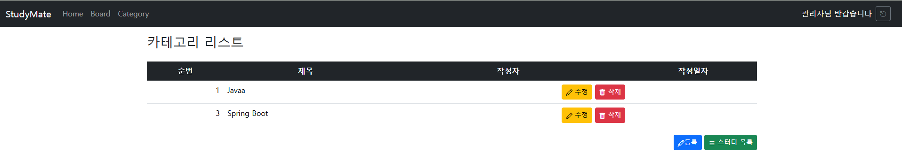
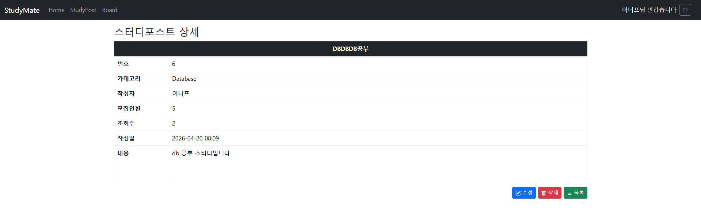
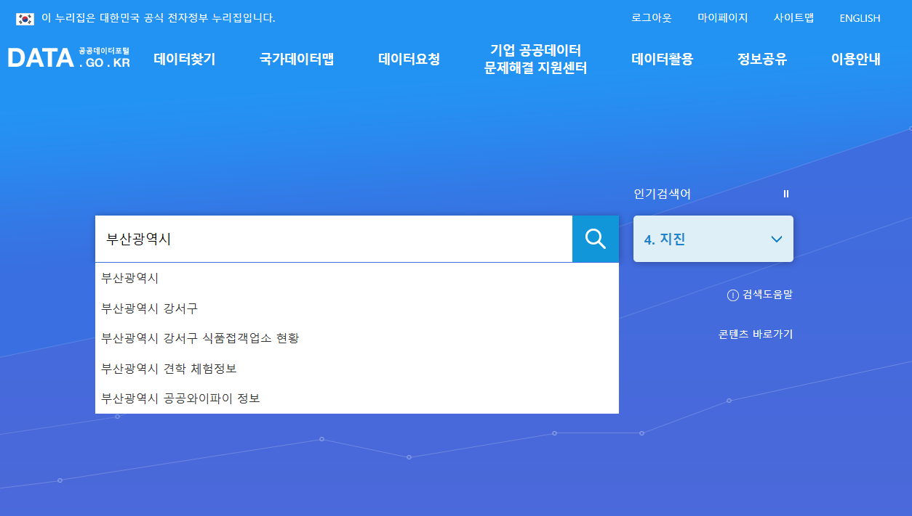
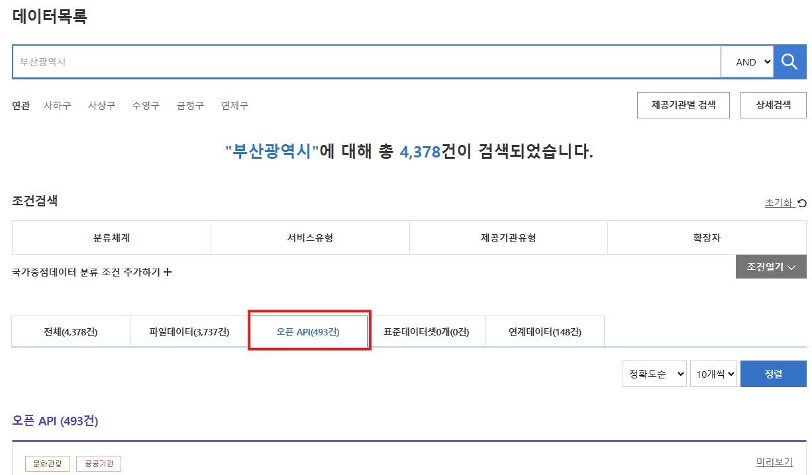
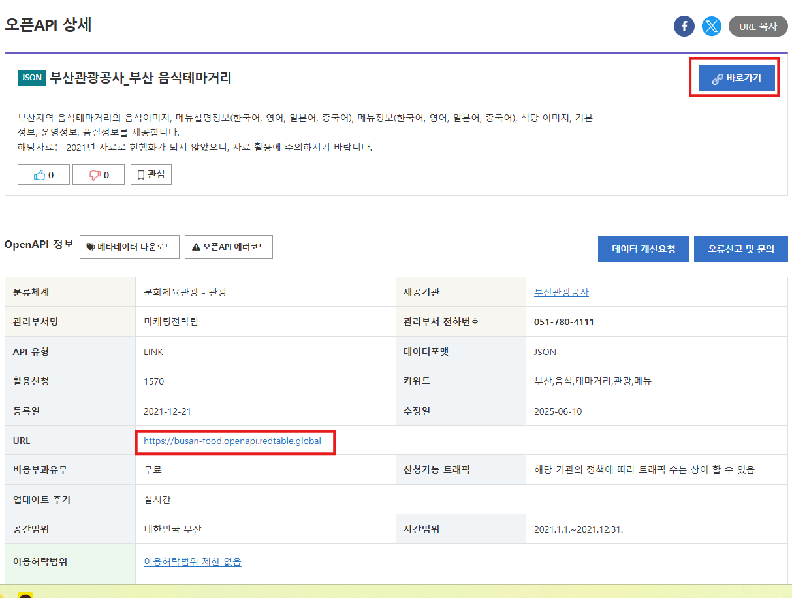
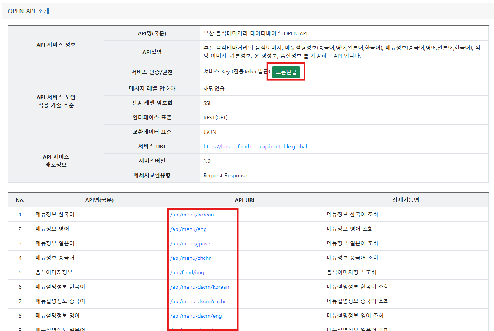
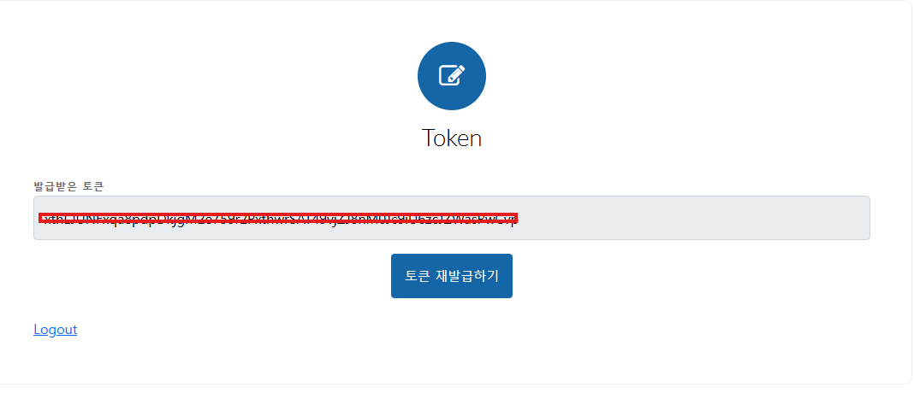
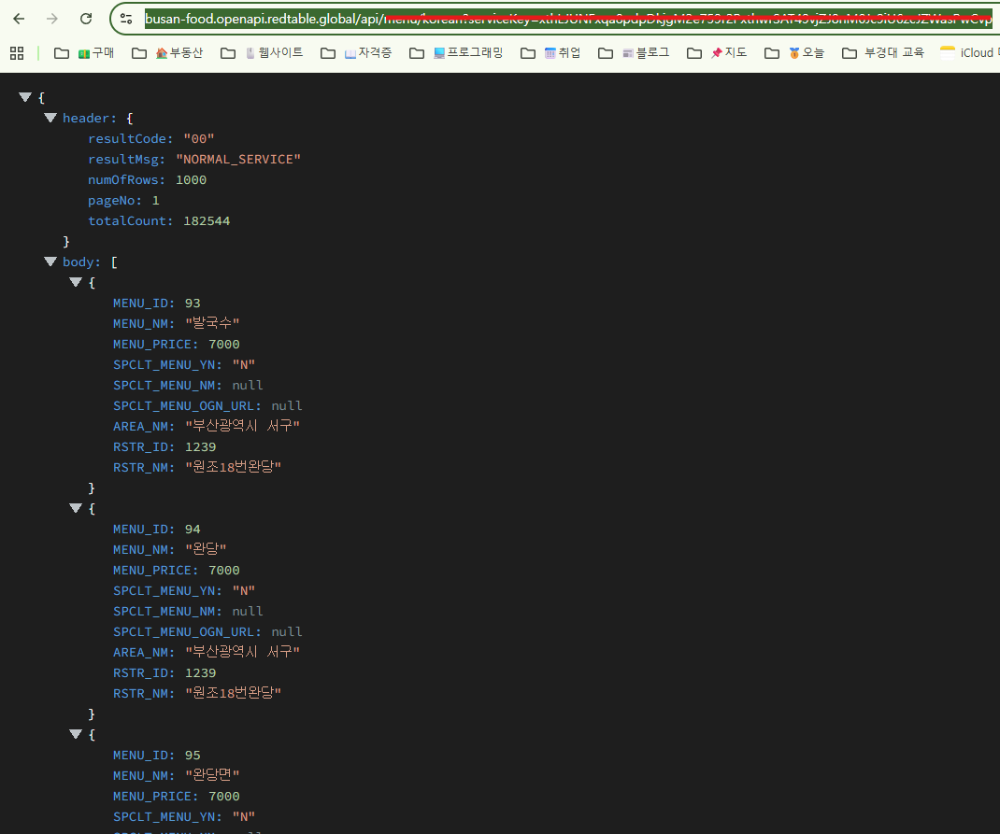

# java-springboot

## 12일차

### 스터디모집 DB설계
- 스터디 모집 ERD
    
- 테이블 관계
    - 스터디 종류 카테고리 1개는 여러개의 스터디글에 포함
        - categories 1 : N study_posts
    - 사용자 1명은 여러개의 스터디글을 쓸 수 있음
        - user_account 1 : N study_posts
    - 사용자 1명은 여러개의 댓글을 씔 수 있음
        - user_account 1 : N comments
    - 스터디 게시글 1개에는 여러개의 댓글이 적힘
        - study_posts 1 : N comments
    - 사용자 1명은 여러 스터디 게시글에 신청가능
        - user_account 1 : N study_applications
    - 스터디 게시글 1개에는 여러 신청이 들어옴
        - study_posts 1 : N study_applications


### 스터디모집 웹사이트
```
StudyGroup
├─ config : 회원가입,로그인시 암호화
├─ controller : MVC 패턴 중 Controller 영역
├─ dto : MVC 패턴 중 Model에 직접연관(DB 테이블 매핑)
├─ mapper : MVC 패턴 중 Model. DB 쿼리 매핑
├─ service : MVC 패턴 중 Model. 비즈니스(도메인) 로직
├─ validation : MVC 패턴 중 View. 화면 입력 검증
└─ resources : 웹페이지 리소스
    ├─ mapper : MVC 패턴 중 Model. DB 쿼리 위치
    ├─ static : View에 포함되는 이미지, CSS, 정적HTML, js 위치
    └─ templates : MVC 패턴 중 View. 실제 화면을 나타낼 영역
```
- 카테고리 CRUD
    - dto, Category 클래스 생성
    - validation, CategoryForm 클래스 생성
    - mapper, CategoryMapper 인터페이스, xml 생성
    - service, CategoryService 클래스 생성
    - controller, Admin용 CategoryController 클래스 생성
    - templates/admin/category/list.html, form.html 생성
    
- 수정, 삭제 기능 완료

- 스터디포스트 CRUD
    - dto, StudyPost 클래스 생성
    - mapper, StudyPostMapper 인터페이스, xml 생성
    - validation, StudyPostForm 클래스 생성: dto, StudyPost 멤버변수 복사 사용
    - service, StudyPostService 클래스 생성
    - controller, StudyPostController 클래스 생성
    - templates/post/list.html, form.html 생성
    

### 조회수 증가
- 스터디 포스트 상세보기 확인


## 13일차
## 14일차

### 스터디모집 기능
- 스터디포스트 아래 댓글기능
- dto, Comment 클래스
- validation, CommentForm 클래스
- mapper, CommentMapper 인터페이스
- templates/mapper, CommentMapper.xml SQL
- service, CommentService 클래스
- controller, CommentController 클래스
- controller, StudyPostController.detail() 댓글 목록, 폼 추가
- html, post/detail.html 화면 추가
- Controller는 사용자의 요청을 받아서 Service로 전달한 뒤 받은 결과를 View로 출력하는 기능. 로그인세션 처리
- Service는 요청에서 Model로 데이터 요청, 돌려받아서 비즈니스로직 처리
- View는 돌려받은 데이터들을 표현

## 15일차
### 관리자 홈관리화면
- 컨텐츠 관리
    - Site_Content 테이블 생성
    - dto, Site 클래스
    - validation, SiteForm 클래스
    - mapper, SiteMapper 인터페이스
    - templates/mapper, SiteMapper.xml
    - service, SiteService 클래스
    - controller, SiteController 클래스
    - controller, HomeController home 메서드 수정

    - 이미지 관리
    - application.properties 에 저장경로 설정!
    - config, FileProperties 클래스 추가
    - config, WebMvcConfig 클래스 추가
    - Site_Image 테이블 생성
    - dto, SiteImage 클래스
    - validation, SiteImageForm 클래스
    - mapper, SiteImageMapper 인터페이스
    - resources/mapper, SiteImageMapper.xml

## 16일차
### 관리자 홈관리 중 이미지 처리
    - service, SiteImageService 클래스
    - controller, SiteImageController 클래스
    - controller, HomeController home 메서드 수정
    - templates/admin/siteImage list.html, form.html 작업


### 홈화면 이미지 표시
- 이미지 표시
  - mapper, SiteImageMapper findAllActive() 메서드 추가, xml 추가
  - service, SiteImageService 메서드 변경
  - home, HomeController home 메서드 로직 변경

### 추가개발 이슈
- [ ] 댓글 삭제 확인창 띄우기
- [ ] Footer 영역, Privacy(개인정보처리방침), Terms(정책) 추가 개발필요
- [ ] 각 입력태그에 PlaceHolder 추가
- [ ] 게시판 댓글 작성자 로그인 아이디 바로 표시하게

- [ ] Features, Gallary 부분 관리자 데이터 처리, 홈화면 이미지 표시
  - Carousel 기능과 동일하게 구현
- [ ] 게시판 첨부파일 추가
- [ ] 관리자 사이트컨텐츠 등록화면, 컨텐츠키를 콤보박스로 변경해보기
- [ ] 관리자 사이트이미지 등록화면, 이미지키를 콤보박스로 변경해보기
- [ ] 회원가입시 이메일이나 주소등 추가 등록데이터 입력
- [ ] 로그인 후 비번변경이나 개인정보 수정화면

## Spring Security
### 개요
- Spring 기반 애플리케이션 인증(Authentication), 권한(Authorization)을 담당하는 보안 프레임워크
    - 인증 : 로그인 기능, 세션처리, CSRF/CORS 보안처리
    - 권한 : 접근제어, 글쓰기 가능여부
- 기본동작
    - 요청 -> 필터체인통과
    - 인증여부 확인
    - 미 로그인시 로그인페이지로 이동
    - 로그인 성공 후 세션에 사용자 정보 저장


---
<br><br><br><br><br><br><br><br><br><br><br><br><br><br><br><br><br><br><br><br><br><br><br><br><br><br><br><br><br><br><br><br><br><br><br><br><br><br><br><br><br><br>

### Spring Boot API - 추후 다시




  
https://busan-food.openapi.redtable.global/api/menu/korean?serviceKey=api키  


- Spring Boot RestApi 서버 프로젝트
    - 나머지 진행은 이전과 동일
    - Spring Web 의존성만 체크
    - build.gradle 오픈 새 의존성 추가
        - `implementation 'com.fasterxml.jackson.dataformat:jackson-dataformat-xml`
            - Jackson으로 XML을 읽고 쓰게 해주는 모듈

- 동작 순서
1. 브라우저 요청
2. Spring Boot서버
3. 공공데이터 포털 OpenAPI 호출
4. JSON 응답
5. 필요 데이터만 가공 후
6. REST API로 반환