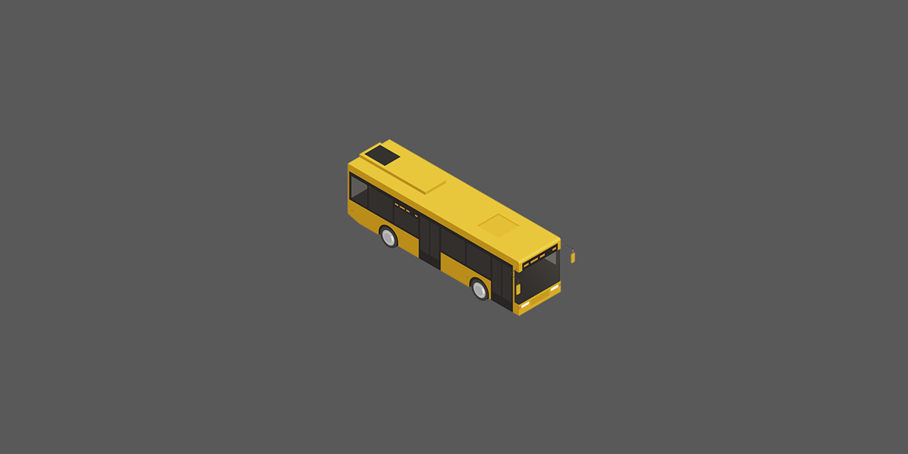
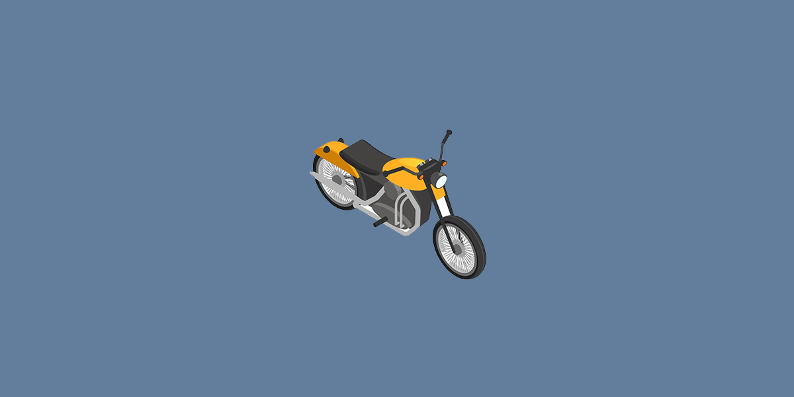
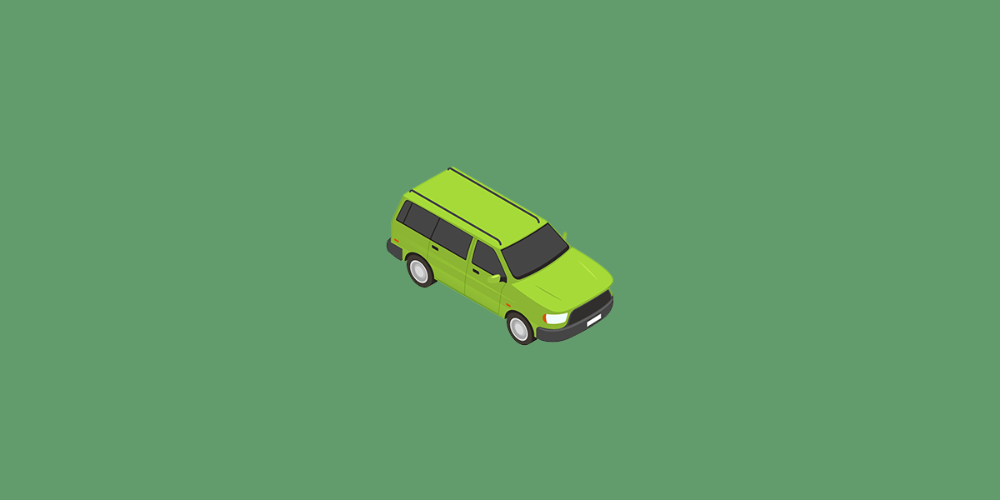

# 문제 1. 스크롤바 100px 내리면 로고 폰트 사이즈 작게 만들기
```css
.navbar {
  position : fixed;
  width : 100%;
  z-index : 5
}
.navbar-brand {
  font-size : 30px;
  transition : all 1s;
}
```
- 상단 메뉴 상단 고정
- 로그 폰트 사이즈 키우기
- 스크롤바를 100px 내리면 폰트사이즈 줄이기

<br>

### 스크롤바를 얼마나 내렸는지 알 수 있어야 함
```js
window.addEventListener('scroll', function(){
  console.log('안녕')
});
```
- 스크롤바를 조작하면 scroll 이벤트 발생
- scroll 이벤트리스너를 전체 페이지에 달면 전체 페이지를 스크롤할 때마다 원하는 코드 실행 가능
- 여기서 `window`는 전체 페이지를 의미함

<br>

# 스크롤 관련 기능
```js
window.addEventListener('scroll', function(){
  console.log( window.scrollY )
});
```
- `window.scrollY`: 현재 페이지를 얼마나 위에서 스크롤했는지 px 단위로 알려줌
- `window.scrollX`: 가로로 얼마나 스크롤했는지 알려줌(가로 스크롤바 있을 경우)

<br>

```js
window.scrollTo(0, 100)
```
- `window.scrollTo(x, y)`: 강제로 스크롤바를 움직일 수 있다
- 위에서 부터 100px 위치로 스크롤 해줌

<br>

```js
window.scrollBy(0, 100)
```
- `window.scrollBy(x, y)`: 현재 위치에서부터 스크롤 해줌
- 현재 위치에서부터 +100px 만큼 스크롤 해줌
- bootstrap를 설치했을 경우 천천히 이동할 수 있음
    ```css
    :root {
    scroll-behavior: auto;
    }
    ```
    - css 파일 맨 위에 추가하면 해결됨

<br>

```js
$(window).on('scroll', function(){
  $(window).scrollTop();
})
```
- jQuery 버전
- `$(window).scrollTop()`: 현재 페이지 스크롤 양 알려줌
- `$(window).scrollTop(100)`: 페이지 강제 이동 해줌

<br>

# 문제2. 박스 끝까지 스크롤시 알림 띄우기
```html
<div class="lorem" style="width: 200px; height: 100px; overflow-y: scroll">
  Lorem ipsum dolor sit amet, consectetur adipisicing elit. Quae voluptas voluptatum minus praesentium fugit debitis at, laborum ipsa itaque placeat sit, excepturi eius. Nostrum perspiciatis, eligendi quae consectetur praesentium exercitationem.
</div>
```
- 박스 추가

<br>

### 해당 박스를 끝까지 스크롤하면 alert()를 띄우기
- div 스크롤바 내린 양 == div 실제높이일 경우 alert

div 스크롤바 내린 양
```js
$('.lorem').on('scroll', function(){
  var 스크롤양 = document.querySelector('.lorem').scrollTop;
  console.log(스크롤양);
});
```
- 박스를 셀렉터로 찾고 `.scrollTop`를 붙이면 스크롤바를 위에서부터 얼마나 내렸는지 알려줌

<br>

div 박스 높이 구하는 방법
```js
$('.lorem').on('scroll', function(){
  var 스크롤양 = document.querySelector('.lorem').scrollTop;
  var 실제높이 = document.querySelector('.lorem').scrollHeight;
  console.log(스크롤양, 실제높이);
});
```
- `.scrollHeight`
- 박스가 화면에 보이는 부분의 높이는 `.clientHeight`

<br>

# 숙제1. 페이지 스크롤바 100px 내리면 로그 폰트 사이즈 작게
페이지 스크롤바를 100px 이상 내리면 폰트사이즈 작게 만들기
```js
<script>
  if (window.scrollY > 100) {
    $('.navbar-brand').css('font-size', '20px');
  }
</script>
```
- `<script>`태그 안에 적으면 페이지 로드 할 때 1회 실행되고 끝남
- 유저가 페이지 스크롤바를 건드릴 때마다 코드를 실행해줘야 잘됨
    ```js
    <script>
    $(window).on('scroll', function(){
        if (window.scrollY > 100) {
        $('.navbar-brand').css('font-size', '20px');
        }
    });
    </script>
    ```
    - 스크롤바 만질 때마다 코드를 실행하고 싶으면 `스크롤 이벤트 리스너` 사용

<br>

# 숙제2. 회원약간 박스 거의 끝까지 스크롤하면 alert 띄우기
div 박스 스크롤양 + 보이는 높이 = 실제 높이
```js
$('.lorem').on('scroll', function(){
  var 스크롤양 = document.querySelector('.lorem').scrollTop;
  var 실제높이 = document.querySelector('.lorem').scrollHeight;
  var 높이 = document.querySelector('.lorem').clientHeight;
  if (스크롤양 + 높이 > 실제높이 - 10) {
    alert('다읽음')
  }
});
```
- 바닥~ 10px 위치에 스크롤바가 있을 때 alert를 띄우기

<br>

### 스크롤 다룰 때 주의점
1. 스크롤 이벤트 리스너 안의 코드는 1초에 60번 이상 실행됨
    - 스크롤 이벤트 리스너는 많이 달면 성능저하 발생 -> 스크롤바 1개마다 1개만 사용
2. 스크롤 이벤트 리스너 안의 코드는 1초에 여러 번 실행되니까 바닥 체크하는 코드도 여러 번 실행될 수 있다
    - alert가 2번 실행될 수도 있다는 뜻
    - 변수 활용하면 됨

<br>

### 현재 페이지를 끝까지 스크롤했는지 체크하려면?
div 박스를 찾는 것이 아닌  
현재 페이지를 찾아서 `.scrollTop.clientHeight`를 붙이면 됨
```js
document.querySelector('html').scrollTop;  //현재 웹페이지 스크롤양
document.querySelector('html').scrollHeight; //현재 웹페이지 실제높이
document.querySelector('html').clientHeight; //현재 웹페이지 보이는 높이임
```
- `.scrollTop`가 길면 `window.scrollY` 사용하면 됨

<br>

### 주의
1. 웹페이지 `scrollHeight` 구할 땐 브라우저마다 아주 약간의 오차가있을 수 있어서 테스트해보는게 좋습니다.

2. 웹페이지 `scrollHeight` 구하는 코드는 페이지 로드가 완료되고나서 실행해야 정확합니다. 그래서 `<body>` 끝나기 전에 적는게 좋습니다.

<br>

# 교훈
코드 외워봤자 다음날 다 까먹음. 
1. 스크롤바 조작할 때 마다 코드실행가능하구나
2. 박스의 숨겨진 실제 높이도 구할 수 있구나 
3. 스크롤내린 양도 구할 수 있군  
이런거 이해하고 지나가면 충분, 문법은 필요할 때 찾아쓰면 됨 

## 응용
### 페이지 내릴 때 마다 페이지를 얼마나 읽었는지 진척도를 알려주는 UI 같은건 어떻게 만들면 될까요?

까만색의 가로로 긴 div 박스 하나 만들고,  
페이지를 1% 읽으면 div 박스 길이는 1%  
페이지를 50%정도 읽으면 div 박스 길이는 50%  
페이지 다 읽으면 div 박스 길이는 100%  

<br>

# 정리
```html
<!doctype html>
<html lang="en">
  <head>
    <meta charset="utf-8">
    <meta name="viewport" content="width=device-width, initial-scale=1">
    <title>Bootstrap demo</title>
    <link href="https://cdn.jsdelivr.net/npm/bootstrap@5.3.2/dist/css/bootstrap.min.css" rel="stylesheet" integrity="sha384-T3c6CoIi6uLrA9TneNEoa7RxnatzjcDSCmG1MXxSR1GAsXEV/Dwwykc2MPK8M2HN" crossorigin="anonymous">
    <link rel="stylesheet" href="main.css">

    <script src="https://code.jquery.com/jquery-3.7.1.min.js" integrity="sha256-/JqT3SQfawRcv/BIHPThkBvs0OEvtFFmqPF/lYI/Cxo=" crossorigin="anonymous"></script>
  </head>
  <body class="">

    <div class="black-bg">
      <div class="white-bg">
        <h4>로그인하세요</h4>
        
        <form action="success.html">
          <div class="my-3">
            <input type="text" class="form-control" id="email">
           </div>
           <div class="my-3">
             <input type="password" class="form-control" id="password">
           </div>
           <button type="submit" class="btn btn-primary" id="send">전송</button>
           <button type="button" class="btn btn-danger" id="close">닫기</button>
        </form>

      </div>
    </div>


    <script>

      $('form').on('submit', function(e) {
        var inputId = document.getElementById('email').value;
        var inputPass = document.getElementById('password').value;

        if (inputId === ''){
          alert('아이디를 입력을 해주세요');
        } else if (inputPass === ''){
          alert('비밀번호를 입력을 해주세요');
        }
        if (/\S+@\S+.\S+/.test(inputId)) {
          alert('이메일 형식 아님');
          e.preventDefault();
        }
        if(/[A-Z]/.test(inputPass) == false) {
          alert('대문자 없음');
        }

        if (document.getElementById('password').value.length < 6){
          alert('비밀번호가 6자리 미만입니다')
        }
      });

    </script>

    <nav class="navbar navbar-light bg-light">
        <div class="container-fluid">
          <span class="navbar-brand">JSShop</span>
          <span class="badge bg-dark">Dark 🔄</span>
          <button  class="navbar-toggler" type="button">
            <span class="navbar-toggler-icon"></span>
          </button>
        </div>
    </nav> 

    <script>

      $(window).on('scroll', function() {
        if (window.scrollY > 100) {
          $('.navbar-brand').css('font-size', '20px');
        } else {
          $('.navbar-brand').css('font-size', '30px');
        }
      });
      

    </script>

    <script>

      var count = 0;

      $('.badge').on('click', function() {
        count++;
        if (count % 2 == 1) {
          $('.badge').html('Light 🔄')
        } else {
          $('.badge').html('Dark 🔄')
        }
      });   

    </script>

    <ul class="list-group" id="test1">
        <li class="list-group-item">An item</li>
        <li class="list-group-item">A second item</li>
        <li class="list-group-item">A third item</li>
        <li class="list-group-item">A fourth item</li>
        <li class="list-group-item">And a fifth one</li>
    </ul>

    <div class="main-bg">
      <h4>Shirts on Sale</h4>
      <button id="login" class="btn btn-danger">로그인</button>
    </div>

    <div class="lorem" style="width: 200px; height: 100px; overflow-y: scroll;">Lorem ipsum, dolor sit amet consectetur adipisicing elit. Totam minus ea id adipisci iusto harum sunt aliquid amet a debitis. Dolore mollitia quaerat accusantium voluptates et nam cupiditate amet. Quaerat?</div>

    <script>

      $('.lorem').on('scroll', function() {
        var 스크롤양 = document.querySelector('.lorem').scrollTop;
        var 실제높이 = document.querySelector('.lorem').scrollHeight;
        var 높이 = document.querySelector('.lorem').clientHeight;

        if (스크롤양 + 높이 > 실제높이 - 10){
          alert('다 읽음');
        }
      });

    </script>

    <div style="height: 1000px;"></div>

    <div class="alert alert-danger">
      <span id="num">5</span>초 이내 구매 시 사은품 증정!
    </div>
    
    <div style="overflow: hidden;">
      <div class="slide-container">
        <div class="slide-box">
          
        </div>
        <div class="slide-box">
          
        </div>
        <div class="slide-box">
          
        </div>
      </div>
    </div>

    <button class="before">이전</button>
    <button class="slide-1">1</button>
    <button class="slide-2">2</button>
    <button class="slide-3">3</button>
    <button class="next">다음</button>

    <script>

      var slide = 1;

      $('.before').on('click', function() {
        if (slide == `${slide}`) {
          $('.slide-container').css('transform', `translateX(-${slide}00vw)`);
          slide--;
        }
      });

      $('.next').on('click', function() {
        if (slide == `${slide}`) {
          $('.slide-container').css('transform', `translateX(-${slide}00vw)`);
          slide++;
        }
      });
      
      $('.slide-1').on('click', function() {
        $('.slide-container').css('transform', 'translateX(0vw)');
      });
      $('.slide-2').on('click', function() {
        $('.slide-container').css('transform', 'translateX(-100vw)');
      });
      $('.slide-3').on('click', function() {
        $('.slide-container').css('transform', 'translateX(-200vw)');
      });
    </script>

    <script>

      var count = 5

      setInterval(function(){
        count--;
        if (count >= 0) {
          document.querySelector('#num').innerHTML = count;
        }

      }, 1000);

    </script>


    <script>
        $('#login').on('click', function() {
          $('.black-bg').addClass('show-modal');
        });

        $('#close').on('click', function() {
          $('.black-bg').addClass('unShow-modal');
        });

        document.querySelector('.navbar-toggler').addEventListener('click', function() {
            document.querySelector('.list-group').classList.toggle('show');
        });

    </script>

    <script src="https://cdn.jsdelivr.net/npm/bootstrap@5.3.2/dist/js/bootstrap.bundle.min.js" integrity="sha384-C6RzsynM9kWDrMNeT87bh95OGNyZPhcTNXj1NW7RuBCsyN/o0jlpcV8Qyq46cDfL" crossorigin="anonymous"></script>
  </body>
</html>
```

```css
:root {
  scroll-behavior: auto;
}

.alert-box {
    background-color: skyblue;
    padding: 20px;
    color: white;
    border-radius: 5px;
    display: none;
}

.list-group {
    display: none;
}

.show {
    display: block;
}

.black-bg {
  width : 100%;
  height : 100%;
  position : fixed;
  background : rgba(0,0,0,0.5);
  z-index : 5;
  padding: 30px;
  visibility: hidden;
  opacity: 0;
  transition: all 1s;
}

.white-bg {
  background: white;
  border-radius: 5px;
  padding: 30px;
}

.show-modal {
  visibility: visible;
  opacity: 1;
}

.unShow-modal {
  display: none;
}

.main-bg {
  padding: 100px 20px;
  background: lightgray;
}

.dark {
  background-color: black;
  color: white;
}

.slide-container {
  width: 300vw;
  transition: all 1s;
}

.slide-box {
  width: 100vw;
  float: left;
}

.slide-box img {
  width: 100%;
}

.navbar {
  position: fixed;
  width: 100%;
  z-index: 5;
}

.navbar-brand {
  font-size: 30px;
  transition: all 1s;
}
```