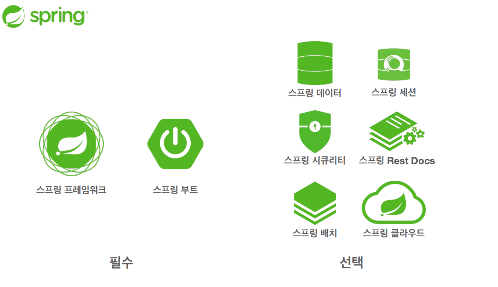

# 스프링 기본

## 2. 객체 지향 설계와 스프링
### 스프링 생태계

### 스프링의 진짜 핵심
- 스프링은 자바 언어 기반의 프레임워크
- 자바 언어의 가장 큰 특징: 객체 지향 언어
- 스프링은 객체지향 언에가 가진 강력한 특징을 살려내는 프레임워크
- 스프링은 좋은 객체 지향 애플리케이션을 개발할 수 있게 도와주는 프레임워크

### 역할과 구현의 분리
- 역할과 구현으로 구분하면 세상이 단순해지고, 유연해지며 변경도 편리해진다
- 장점
  - 클라이언트는 대상의 역할(인터페이스)만 알면 된다
  - 클라이언트는 구현 대상의 내부 구조를 몰라도 된다
  - 클라이언트는 구현 대상의 내부 구조가 변경되어도 영향을 받지 않는다
  - 클라이언트는 구현 대상 자체를 변경해도 영향을 받지 않는다
- 자바 언어의 다형성을 활용
  - 역할 = 인터페이스
  - 구현 = 인터페이스를 구현한 클래스, 구현 객체
- 객체를 설계할 때 역할과 구현을 명확히 분리
- 객체 설계시 역할(인터페이스)을 먼저 부여하고, 그 역할을 수행하는 구현 객체 만들기

### 객체의 협력이라는 관계부터 생각
- 혼자 있는 객체는 없다
- 클라이언트: 요청
- 서버: 응답
- 수 많은 객체 클라이언트와 객체 서버는 서로 협력 관계를 가진다

### 다형성의 본질
- 인터페이스를 구현한 객체 인스턴스를 실행 시점에 유연하게 변경할 수 있다
- 다형성의 본질을 이해하려면 협력이라는 객체사이의 관계에서 시작해야함
- **클라이언트를 변경하지 않고, 서버의 구현 기능을 유연하게 변경할 수 있다**

### 정리
- 실세계의 역할과 구현이라는 편리한 컨셉을 다형성을 통해 객체 세상으로 가져올 수 있음
- 유연하고 변경 용이
- 확장 가능한 설계
- 클라이언트에 영향을 주지 않는 변경 가능
- 인터페이스를 안정적으로 잘 설계하는 것이 중요

### 한계
- 역할(인터페이스) 자체가 변하면, 클라이언트, 서버 모두에 큰 변경이 발생한다
- 인터페이스를 안정적으로 잘 설계하는 것이 중요

### 스프링과 객체 지향
- 다형성이 가장 중요하다!!
- 스프링은 다형성을 극대화해서 이용할 수 있게 도와준다
- 제어의 역전(IoC), 의존관계 주입(DI)은 다형성을 활용해서 역할과 구현을 편리하게 다룰 수 있도록 지원한다