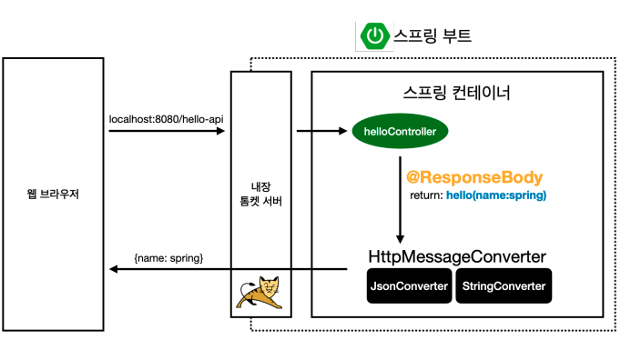
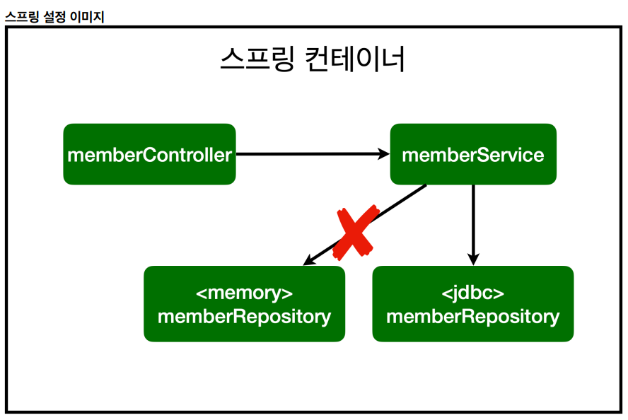

# 스프링 입문

## 2. 프로젝트 환경설정
### [프로젝트 생성](https://start.spring.io/)

Artifact: build 되어 나올때의 결과물  
Dependencies: 스프링부트로 프로젝트를 시작할 때 어떤 라이브러리를 가져올 건지에 대한 것
Thymeleaf: 템플릿 엔진

### 기본 구조
  
main과 test가 기본적으로 나누어져 있는게 표준적

### build.gradle
예전에는 하나씩 다 쳐야하거나 복붙해야 했지만 요즘엔 build.gradle에서 관리해서 편해짐  
설정 파일  
버전 설정하고 라이브러리 땡겨온다 정도로 이해
```java
plugins {
	id 'java'
	id 'org.springframework.boot' version '4.0.5' // 스프링 부트 버전
	id 'io.spring.dependency-management' version '1.1.7'
}

group = 'hello'
version = '0.0.1-SNAPSHOT'

java {
	toolchain {
		languageVersion = JavaLanguageVersion.of(21)
	}
}

repositories {
	mavenCentral() // 밑의 dependencies 라이브러리를 다운 받아야 하는데 mavenCentral라는 공개 된 사이트에서 다운받게 설정해둔 것
}

dependencies { // 프로젝트 설정시 가져온 것들, thymeleaf, web
	implementation 'org.springframework.boot:spring-boot-starter-thymeleaf'
	implementation 'org.springframework.boot:spring-boot-starter-webmvc'
	testImplementation 'org.springframework.boot:spring-boot-starter-thymeleaf-test'
	testImplementation 'org.springframework.boot:spring-boot-starter-webmvc-test'
	testRuntimeOnly 'org.junit.platform:junit-platform-launcher' // 기본적으로 테스트 라이브러리가 자동으로 들어감, junit5
}

tasks.named('test') {
	useJUnitPlatform()
}
```

### HelloSpringApplication.java
```java
@SpringBootApplication
public class HelloSpringApplication {

	public static void main(String[] args) {
		SpringApplication.run(HelloSpringApplication.class, args);
	}
}
```
- @SpringBootApplication이 스프링 부트 애플리케이션을 실행해주고 톰캣이라는 웹 서버를 내장하고 있어서 톰캣을 자체적으로 띄우면서 스프링 부트를 동작시킴 

### External Libraries
. 
- 땡겨온 라이브러리들 확인

### Gradle에 Dependencies
- Gradle은 의존관계가 있는 라이브러리를 함께 다운로드 함

### 스프링 부트 라이브러리
- spring-boot-starter-web
	- spring-boot-starter-tomcat: 톰캣 (웹서버)
	- spring-webmvc: 스프링 웹 MVC

- spring-boot-starter-thymeleaf: 타임리프 템플릿 엔진(View)

- spring-boot-starter(공통): 스프링 부트 + 스프링 코어 + 로깅
	- spring-boot
		. 
		- spring-core
	- spring-boot-starter-logging
		. 
		- logback, slf4j

### 테스트 라이브러리
- spring-boot-starter-test
	. 
	- junit: 테스트 프레임워크, 테스트 할 때 사용
	- mockito: 목 라이브러리
	- assertj: 테스트 코드를 좀 더 편하게 작성하게 도와주는 라이브러리
	- spring-test: 스프링 통합 테스트 지원

### View 환경설정
- [spring boot의 welcome-page](https://docs.spring.io/spring-boot/reference/web/reactive.html#web.reactive.webflux.welcome-page)
- [스프링 공식 튜토리얼](https://spring.io/guides/gs/serving-web-content)
- [thymeleaf 스프링부트 메뉴얼](https://docs.spring.io/spring-boot/reference/web/reactive.html#web.reactive.webflux.template-engines)

### 스프링에서 화면 보이는 원리
- 컨트롤러에서 리턴 값으로 문자를 반환하면 뷰 리졸버(viewResolver)가 화면을 찾아서 처리함
	- 스프링 부트 템플릿 엔진 viewName 매핑
	- `resources:templates/` + viewName + `.html`
	```java
	@Controller
	public class HelloController {

		@GetMapping("hello")
		public String hello(Model model) {
			model.addAttribute("data", "hello");
			return "hello";
		}
	}
	```

### 빌드하고 실행하기
1. 프로젝트 폴더 파일 이동
	- `cd` 명령어 사용
2. 빌드
	- `./gradlew build`: 맥
	- `gradlew.bat build`: 윈도우
	- .jar 파일 생성됨
3. build 폴더 안에 libs 안으로 들어감
	- `cd build/libs`
4. 실행
	- `java -jar 만들어진파일.jar`

윈도우 사용자를 위한 팁
콘솔로 이동 명령 프롬프트(cmd)로 이동
./gradlew gradlew.bat 를 실행하면 됩니다.
명령 프롬프트에서 gradlew.bat 를 실행하려면 gradlew 하고 엔터를 치면 됩니다.
gradlew build
폴더 목록 확인 ls dir
윈도우에서 Git bash 터미널 사용하기

---

## 3. 스프링 웹 개발 기초
### thymeleaf 엔진의 장점
- html 파일의 껍데기를 그대로 볼 수 있다(파일 절대 경로)

### @RequiredParam
- `required = false`가 기본값이라서 값을 넘겨줘야 함

### @ResponseBody
-  @ResponseBody를 사용하면 뷰 리졸버(viewResolver)를 사용하지 않음
- 대신에 HTTP의 BODY에 문자 내용을 직접 반환함
- @ResponseBody 를 사용하고, 객체를 반환하면 객체가 JSON으로 변환됨

### @ResponseBody 사용
- HTTP의 BODY에 문자 내용을 직접 반환
- viewResolver 대신에 HttpMessageConverter가 동작
- 기본 문자처리: StringHttpMessageConverter
- 기본 객체처리: MappingJackson2HttpMessageConverter
- byte 처리 등등 기타 여러 HttpMessageConverter가 기본으로 등록되어 있음  


---

## 4. 회원 관리 예제-백엔드 개발
### Optional
- null을 처리하는 방법으로 null을 그대로 반환하는 것보다 `Optional`으로 감싸서 반환하는 것을 선호함
- 자바 8부터 들어가있는 기능
- Optional.ofNullable: Null이 반환될 가능성이 있는 경우 사용
	```java
	@Override
    public Optional<Member> findById(Long id) {
        return Optional.ofNullable(store.get(id));
    }
	```

### concurrenthashmap - 나중에 좀 더 알아보자
- 동시성 문제가 있을 수 있어서 공유되는 변수일 경우 concurrenthashmap을 사용
- 혹은 AtomicLong 사용 고려 -> 멀티스레드와 동시성 공부해보기

### 테스트 케이스 - 아직 좀 어려움
- 테스트는 순서가 따로 없음
- 테스트는 각각 독립적으로 실행되어야 함
- 중요: 하나의 테스트가 끝날 때마다 초기화해줘야 함: `@AfterEach`
	- 한 번에 테스트를 실행하면 메모리 DB에 직전 테스트의 결과가 남아 있을 수 있음 -> 다음 테스트 실패할 수 있음
- 테스트를 실행하기 전 `@BeforeEach`
	- 테스트가 서로 영향이 없도록 새로운 객체를 생성하고 의존관계를 새로 맺어줌

### Optional의 ifPreset()
- Optional 객체가 값을 가지고 있다면 true, 없다면 false 
- 근데 Optional로 반환되면 보기가 썩.. 좋지 않음
	```java
	public Long join(Member member) {
        // 같은 이름이 있는 중복 회원x
        Optional<Member> result = memberRepository.findByName(member.getName());
        result.ifPresent(m -> {
            throw new IllegalStateException("이미 존재하는 회원입니다.");
        });

        memberRepository.save(member);
        return member.getId();
    }
	```
- 그래서 변수를 따로 빼지않고 ifPresent를 바로 사용
	```java
	    public Long join(Member member) {
        // 같은 이름이 있는 중복 회원x
        memberRepository.findByName(member.getName())
                .ifPresent(m -> {
                    throw new IllegalStateException("이미 존재하는 회원입니다.");
                });

        memberRepository.save(member);
        return member.getId();
    }
	```

### 서비스 클래스
- service 클래스는 비즈니스에 가까운 용어를 사용하는 것이 좋다
- 서비스 클래스에서 직접 객체를 만들면 테스트 코드에서 객체를 또 생성하는데 repository에서 static이 안붙으면 서로 다른 객체이기 떄문에 틀린 테스트 코드가 나올 수 있다
	- 따라서 서비스 클래스에서 생성자를 주입 시키는 걸로 바꾸는게 좋다
	```java
	// 변경 전
	private final MemberRepository memberRepository = new MemoryMemberRepository();

	// 변경 후
	private final MemberRepository memberRepository;

    public MemberService(MemberRepository memberRepository) {
        this.memberRepository = memberRepository;
    }
	```

### 테스트 코드
- 메서드 이름을 한글로 적어도 상관없음
	- 테스트 코드는 빌드될 때 실제 코드에 포함안돼서 괜찮음
- 추천코드: given, when, then
	```java
	//given

	//when

	//then
	```

---

## 5. 스프링 빈과 의존관계
### @Autowired
- 스프링이 연관된 객체를 스프링 컨테이너에서 찾아서 넣어줌
- 스프링 빈이 등록되어 있는 것만 넣어줌
- 생성자에 @Autowired를 사용하면 객체 생성 시점에 스프링 컨테이너에서 해당 스프링 빈을 찾아 주입한다
- 즉, @Autowired를 통한 DI는 스프링이 관리하는 객체에서만 동작한다
- 참고: 생성자가 1개만 있으면 @Autowired 생략 가능(생성자가 2개면 어떤 걸 넣어야 할지 몰라 표기 해줘야 함)

### 스프링 빈을 등록하는 2가지 방법
1. 컴포넌트 스캔과 자동 의존관계 설정
	- @Component 애노테이션이 있으면 스프링 빈으로 자동 등록됨
	- @Controller, @Service, @Repository는 @Component를 포함하기 때문에 스프링 빈으로 자동 등록된다
	- 참고: 스프링 컨테이너에 빈을 등록할 때, 기본적으로 singleton으로 등록
2. 자바 코드로 직접 스프링 빈 등록
	- @Bean 애노테이션을 사용하여 주입해준다
	```java
	@Configuration
	public class SpringConfig {

		@Bean
		public MemberService memberService() {
			return new MemberService(memberRepository());
		}

		@Bean
		public MemberRepository memberRepository() {
			return new MemoryMemberRepository();
		}
	}
	```

### 의존성 주입 DI
1. 필드 주입
	- 스프링이 시작할 때만 DI를 해주고 향후 바꿀 수 있는 방법이 없다
	```java
	@Controller
	public class MemberController {

		@Autowired
		private MemberService memberService;
	}
	```
2. setter 주입
	- 애플리케이션 로딩 시점에 바꾸긴하는데 한 번 설정되면 잘 안바꾼다
	- 그런데 setter 주입으로하면 public으로 노출이 되어있다
		- `memberService.setMemberService`처럼 다른 개발자가 호출을 할 수도 있다는 의미
	```java
	@Controller
	public class MemberController {

		private MemberService memberService;

		@Autowired
		public void setMemberService(MemberService memberService) {
			this.memberService = memberService;
		}
	}
	```

3. 생성자 주입(권장)
	- 스프링 컨테이너가 조립되는 시점, 처음 세팅이 되는 시점에 주입이 되고 끝남
	- 의존관계가 실행 중에 동적으로 변하는 경우(서버가 run되고 있는 상태에서 변경)가 거의 없어 생성자 주입을 권장
	```java
	@Controller
	public class MemberController {

		private final MemberService memberService;

		@Autowired
		public MemberController(MemberService memberService) {
			this.memberService = memberService;
		}
	}
	```

## 6. 웹 MVC 개발
## 7. 스프링 DB 접근 기술
- 스프링은 DB와 연동을 하려면 JDBC라는 드라이버가 있어야 해서 `build.gralde`에 값을 추가해 준다
	```gradle
	implementation 'org.springframework.boot:spring-boot-starter-jdbc'
	```

- 스프링이 DB랑 연결될 때 데이터베이스가 제공하는 클라이언트가 필요하고 해당 설정
	```gradle	
	runtimeOnly 'com.h2database:h2'
	```

- 개방 폐쇠 원칙(OCP, Open-Closed Principle)
	  
	```java
	package hello.hello_spring;

	import hello.hello_spring.repository.JdbcMemberRepository;
	import hello.hello_spring.repository.MemberRepository;
	import hello.hello_spring.repository.MemoryMemberRepository;
	import hello.hello_spring.service.MemberService;
	import org.springframework.beans.factory.annotation.Autowired;
	import org.springframework.context.annotation.Bean;
	import org.springframework.context.annotation.Configuration;

	import javax.sql.DataSource;

	@Configuration
	public class SpringConfig {

		private DataSource dataSource;

		@Autowired
		public SpringConfig(DataSource dataSource) {
			this.dataSource = dataSource;
		}

		@Bean
		public MemberService memberService() {
			return new MemberService(memberRepository());
		}

		@Bean
		public MemberRepository memberRepository() {
	//        return new MemoryMemberRepository();
			return new JdbcMemberRepository(dataSource);
		}
	}
	```
	- 확장에서는 열려있고, 수정, 변경에는 닫혀있다
	- 스프링의 DI(의존성 주입)을 사용하면 기존 코드를 전혀 손대지 않고, 설정만으로 구현 클래스를 변경할 수 있다

### 스프링 통합 테스트
- @SpringBootTest: 스프링 컨테이너와 테스트를 함께 실행
- @Transactional: 테스트 시작 전에 트랜잭션을 시작하고, 테스트 완료 후에 롤백한다, 즉 DB에 데이터가 남지 않아 다음 테스트에 영향을 주지 않는다
- 가급적 순수한 단위 테스트가 좋은 테스트일 확률이 높다, 스프링 컨테이너 없이 테스트 하는게 좀 더 좋을 확률이 높다

### JdbcTemplate
- 아직 좀 여러움

### JPA
- JPA는 기존의 반복 코드는 물론이고, 기본적인 SQL도 JPA가 직접 만들어서 실행해준다.
- JPA를 사용하면, SQL과 데이터 중심의 설계에서 객체 중심의 설계로 패러다임을 전환을 할 수 있다.
- 라이브러리 추가
	```gradle
	implementation 'org.springframework.boot:spring-boot-starter-data-jpa'
	```
- application.properties 설정 추가
	```java
	spring.jpa.show-sql=true
	spring.jpa.hibernate.ddl-auto=none
	```
	- show-sql : JPA가 생성하는 SQL을 출력한다.
	- ddl-auto : JPA는 테이블을 자동으로 생성하는 기능을 제공하는데 none을 사용하면 해당 기능을 끈다.
	- create 를 사용하면 엔티티 정보를 바탕으로 테이블도 직접 생성해준다.
- 어려움

### 스프링 데이터 JPA 제공 기능
- 인터페이스를 통한 기본적인 CRUD
- findByName() , findByEmail() 처럼 메서드 이름 만으로 조회 기능 제공
- 페이징 기능 자동 제공