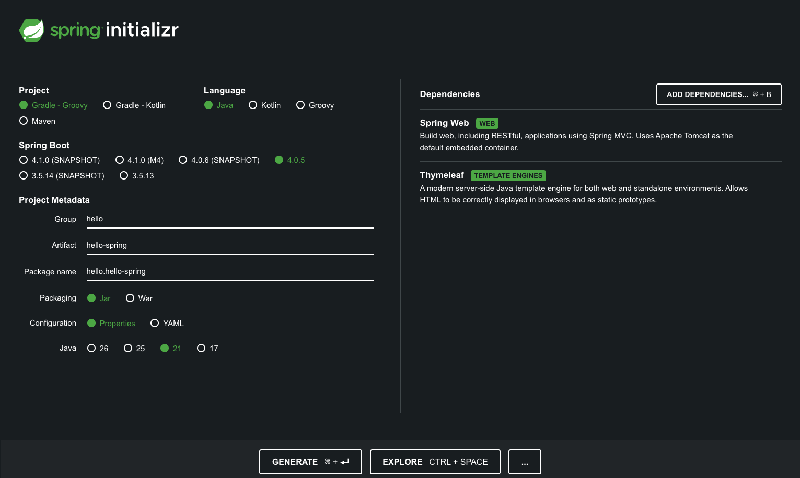
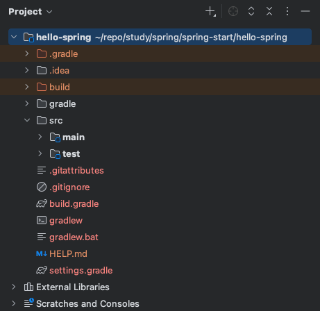
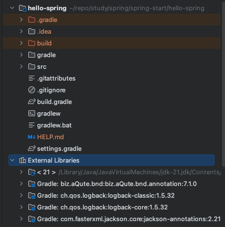
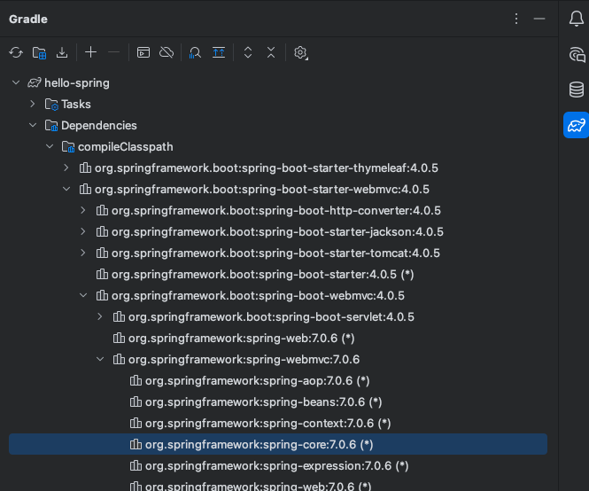
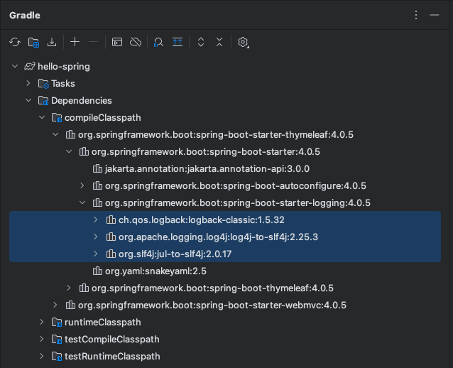
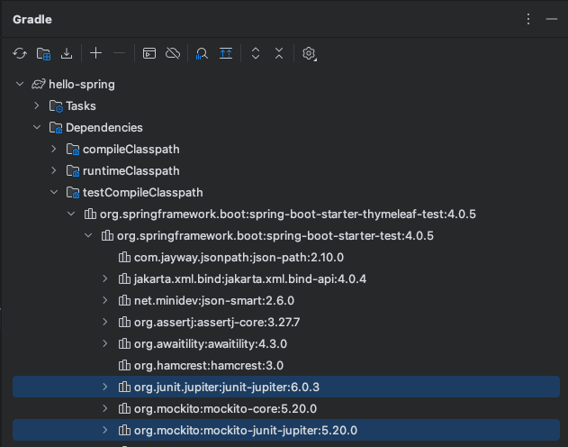

# 스프링 입문
## [프로젝트 생성](https://start.spring.io/)

Artifact: build 되어 나올때의 결과물  
Dependencies: 스프링부트로 프로젝트를 시작할 때 어떤 라이브러리를 가져올 건지에 대한 것
Thymeleaf: 템플릿 엔진

## 기본 구조
  
main과 test가 기본적으로 나누어져 있는게 표준적

## build.gradle
예전에는 하나씩 다 쳐야하거나 복붙해야 했지만 요즘엔 build.gradle에서 관리해서 편해짐  
설정 파일  
버전 설정하고 라이브러리 땡겨온다 정도로 이해
```gradle
plugins {
	id 'java'
	id 'org.springframework.boot' version '4.0.5' // 스프링 부트 버전
	id 'io.spring.dependency-management' version '1.1.7'
}

group = 'hello'
version = '0.0.1-SNAPSHOT'

java {
	toolchain {
		languageVersion = JavaLanguageVersion.of(21)
	}
}

repositories {
	mavenCentral() // 밑의 dependencies 라이브러리를 다운 받아야 하는데 mavenCentral라는 공개 된 사이트에서 다운받게 설정해둔 것
}

dependencies { // 프로젝트 설정시 가져온 것들, thymeleaf, web
	implementation 'org.springframework.boot:spring-boot-starter-thymeleaf'
	implementation 'org.springframework.boot:spring-boot-starter-webmvc'
	testImplementation 'org.springframework.boot:spring-boot-starter-thymeleaf-test'
	testImplementation 'org.springframework.boot:spring-boot-starter-webmvc-test'
	testRuntimeOnly 'org.junit.platform:junit-platform-launcher' // 기본적으로 테스트 라이브러리가 자동으로 들어감, junit5
}

tasks.named('test') {
	useJUnitPlatform()
}

```

## HelloSpringApplication.java
```java
@SpringBootApplication
public class HelloSpringApplication {

	public static void main(String[] args) {
		SpringApplication.run(HelloSpringApplication.class, args);
	}
}
```
- @SpringBootApplication이 스프링 부트 애플리케이션을 실행해주고 톰캣이라는 웹 서버를 내장하고 있어서 톰캣을 자체적으로 띄우면서 스프링 부트를 동작시킴 

## External Libraries

- 땡겨온 라이브러리들 확인

### Gradle에 Dependencies
- Gradle은 의존관계가 있는 라이브러리를 함께 다운로드 함

### 스프링 부트 라이브러리
- spring-boot-starter-web
	- spring-boot-starter-tomcat: 톰캣 (웹서버)
	- spring-webmvc: 스프링 웹 MVC

- spring-boot-starter-thymeleaf: 타임리프 템플릿 엔진(View)

- spring-boot-starter(공통): 스프링 부트 + 스프링 코어 + 로깅
	- spring-boot
		
		- spring-core
	- spring-boot-starter-logging
		
		- logback, slf4j

### 테스트 라이브러리
- spring-boot-starter-test
	
	- junit: 테스트 프레임워크, 테스트 할 때 사용
	- mockito: 목 라이브러리
	- assertj: 테스트 코드를 좀 더 편하게 작성하게 도와주는 라이브러리
	- spring-test: 스프링 통합 테스트 지원
